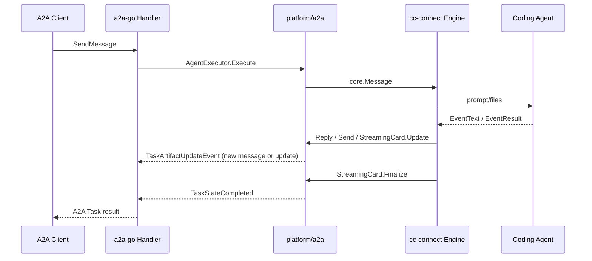

# A2A Platform

The A2A platform exposes a cc-connect project as an A2A JSON-RPC agent server. It uses the official `github.com/a2aproject/a2a-go/v2` SDK for AgentCard, JSON-RPC, and Task protocol behavior.

## Configuration

```toml
[[projects.platforms]]
type = "a2a"

[projects.platforms.options]
listen_addr = ":8010"
path = "/a2a/"
public_url = "https://agent.example.com"
api_token = "optional-bearer-token"
user_header = "X-A2A-User"
agent_name = "cc-connect"
description = "cc-connect A2A bridge"
agent_version = "v10.0.0"
timeout = "30m"
task_ttl = "2h"
max_tasks = 1000

[[projects.platforms.options.skills]]
id = "code-review"
name = "Code Review"
description = "Review code changes and suggest fixes."
tags = ["code", "review"]
examples = ["Review this pull request"]
input_modes = ["text/plain"]
output_modes = ["text/plain"]
```

Common options:

| Option | Default | Description |
|--------|---------|-------------|
| `listen_addr` | `:8010` | HTTP listen address. Alias: `listen` |
| `path` | `/a2a/` | JSON-RPC base path and AgentCard prefix |
| `public_url` | empty | External base URL advertised in AgentCard. If empty, the AgentCard URL is derived from request headers |
| `api_token` | empty | Optional Bearer token. Alias: `token` |
| `user_header` | `X-A2A-User` | HTTP header used as the cc-connect message user id. This is a cc-connect extension, not an A2A protocol field |
| `agent_name` | `CC-Connect` | AgentCard name |
| `description` | generic bridge description | AgentCard description |
| `agent_version` | cc-connect version or `dev` | AgentCard version |
| `timeout` | `30m` | Maximum time to wait for a cc-connect result |
| `task_ttl` | `2h` | How long an in-flight cc-connect bridge waiter can remain pending |
| `max_tasks` | `1000` | Maximum number of in-flight A2A tasks waiting for cc-connect completion |
| `skills` | default bridge skill | AgentCard skills advertised to A2A clients |
| `forward_headers` | empty | Whitelist of HTTP header names exposed to cc-connect hooks as `headers` / `CC_HOOK_HEADERS_JSON`. Not injected into the coding agent prompt. `Authorization` / `Cookie` are always blocked |

## Endpoints

For `path = "/a2a/"`:

- `GET /a2a/.well-known/agent-card.json`
- `POST /a2a/`

If `api_token` is configured, JSON-RPC calls must include:

```text
Authorization: Bearer <api_token>
```

The AgentCard endpoint is public so A2A clients can discover the server.
If `public_url` is not configured, the AgentCard JSON-RPC URL is derived from the request in this order:

1. `Forwarded` header `proto` and `host`.
2. `X-Forwarded-Proto` and `X-Forwarded-Host`.
3. `Host` header or request host.
4. Local listen address fallback.

The message user id is read from the configured `user_header`. By default this is the cc-connect extension header `X-A2A-User`. If the header is absent, cc-connect falls back to `a2a`.

### Forwarding context to cc-connect hooks

Configure a whitelist with `forward_headers`. Matching request headers are attached to the `message.received` and `message.processing` hook events — they are **not** prepended to the coding agent prompt.

```toml
forward_headers = ["X-Tenant-Id", "X-Trace-Id"]
```

Clients send them on the JSON-RPC `POST` request (or via A2A client `ServiceParams`). HTTP hooks receive them as the `headers` object in the JSON payload. Command hooks and custom exec commands receive the same data as `CC_HOOK_HEADERS_JSON`.

A2A `SendMessageRequest.metadata` and `message.metadata` are merged into the hook `ctx` object. Command hooks, custom exec commands, and `message.processing` hooks receive them as `CC_HOOK_CTX_JSON`.

Every hook invocation also receives:

- `message_id` / `CC_HOOK_MESSAGE_ID`
- `channel_name` / `CC_HOOK_CHANNEL_NAME` when the platform provides a chat or channel name

For multi-workspace bootstrap, parse the channel identifier from `CC_HOOK_SESSION_KEY` (for example `slack:C123:U456` or `chat-api:chat-123:conv_...`) and compose the binding store key as `{CC_HOOK_PLATFORM}:{channel}`. Use `{base_dir}/{CC_HOOK_CHANNEL_NAME}` as the convention directory when the platform resolves a human-readable name.

`Authorization`, `Cookie`, and other sensitive headers are never forwarded, even if listed in config.

## Skills

If `[[projects.platforms.options.skills]]` is omitted, the platform advertises one default cc-connect bridge skill. If one or more skills are configured, they replace the default skill.

Each skill requires:

- `id`
- `name`
- `description`

Optional fields:

- `tags`
- `examples`
- `input_modes`
- `output_modes`

## Flow



`Reply` and `Send` emit independent A2A artifacts, matching chat platforms where every call sends a new message. `StreamingCard.Update` updates one stable artifact in place, matching Feishu/Slack progress-message updates. The SDK executor marks the task `completed` when `StreamingCard.Finalize` is called, when core emits a processing-end event for a completed command, the client cancels, or the configured task timeout elapses.

## Message Mapping

- Text parts are appended to `core.Message.Content`.
- Data parts are marshaled to JSON and appended to `core.Message.Content`.
- Raw parts are classified by `mediaType` into `core.Message.Images`, `core.Message.Audio`, or `core.Message.Files`, matching Slack/Feishu behavior.
- URL parts are downloaded when possible and classified the same way; failed downloads fall back to `File URL: ...` text.

Outbound file delivery uses the optional `ImageSender` / `FileSender` capabilities. Each `SendImage` or `SendFile` call emits a separate A2A artifact with a raw part (`filename`, `mediaType`, bytes), while text still flows through `Reply`, `Send`, and `StreamingCard`.

The cc-connect session key is based on the A2A `contextId`: `a2a:<contextId>`. This lets multiple A2A tasks in the same context continue the same agent session. If `contextId` is absent, the platform falls back to the A2A task id.

`StreamingCard.Finalize` marks the task completed. `Reply` and `Send` create new artifacts without local buffering; `StreamingCard.Update` replaces the current streaming artifact. Core processing-end notifications complete command paths that do not use a streaming card; duplicate completion after `Finalize` is ignored.
