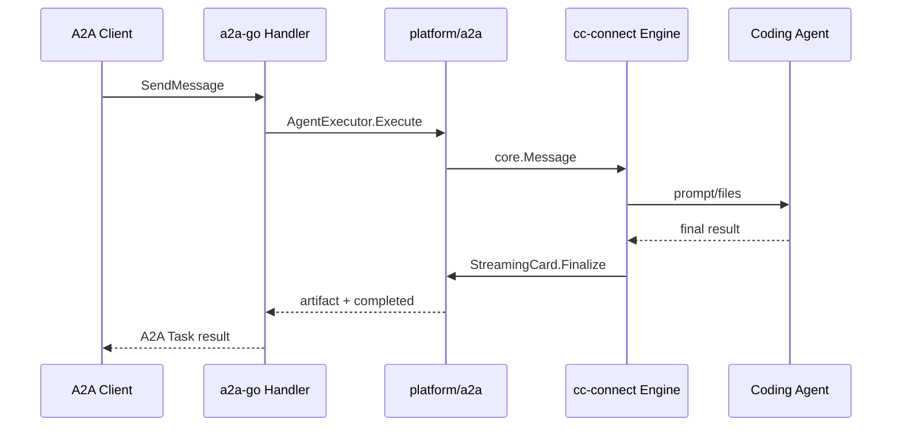

# A2A Platform

The A2A platform exposes a cc-connect project as an A2A JSON-RPC agent server. It uses the official `github.com/a2aproject/a2a-go/v2` SDK for AgentCard, JSON-RPC, and Task protocol behavior.

## Configuration

```toml
[[projects.platforms]]
type = "a2a"

[projects.platforms.options]
listen_addr = ":8010"
path = "/a2a/"
public_url = "https://agent.example.com"
api_token = "optional-bearer-token"
agent_name = "cc-connect"
description = "cc-connect A2A bridge"
agent_version = "v10.0.0"
timeout = "30m"
task_ttl = "2h"
max_tasks = 1000

[[projects.platforms.options.skills]]
id = "code-review"
name = "Code Review"
description = "Review code changes and suggest fixes."
tags = ["code", "review"]
examples = ["Review this pull request"]
input_modes = ["text/plain"]
output_modes = ["text/plain"]
```

Common options:

| Option | Default | Description |
|--------|---------|-------------|
| `listen_addr` | `:8010` | HTTP listen address. Alias: `listen` |
| `path` | `/a2a/` | JSON-RPC base path and AgentCard prefix |
| `public_url` | empty | External base URL advertised in AgentCard. If empty, the AgentCard URL is derived from request headers |
| `api_token` | empty | Optional Bearer token. Alias: `token` |
| `agent_name` | `CC-Connect` | AgentCard name |
| `description` | generic bridge description | AgentCard description |
| `agent_version` | cc-connect version or `dev` | AgentCard version |
| `timeout` | `30m` | Maximum time to wait for a cc-connect result |
| `task_ttl` | `2h` | How long an in-flight cc-connect bridge waiter can remain pending |
| `max_tasks` | `1000` | Maximum number of in-flight A2A tasks waiting for cc-connect completion |
| `skills` | default bridge skill | AgentCard skills advertised to A2A clients |

## Endpoints

For `path = "/a2a/"`:

- `GET /a2a/.well-known/agent-card.json`
- `POST /a2a/`

If `api_token` is configured, JSON-RPC calls must include:

```text
Authorization: Bearer <api_token>
```

The AgentCard endpoint is public so A2A clients can discover the server.
If `public_url` is not configured, the AgentCard JSON-RPC URL is derived from the request in this order:

1. `Forwarded` header `proto` and `host`.
2. `X-Forwarded-Proto` and `X-Forwarded-Host`.
3. `Host` header or request host.
4. Local listen address fallback.

When `X-A2A-User` is provided, cc-connect uses it as the message user id; otherwise it falls back to `a2a`.

## Skills

If `[[projects.platforms.options.skills]]` is omitted, the platform advertises one default cc-connect bridge skill. If one or more skills are configured, they replace the default skill.

Each skill requires:

- `id`
- `name`
- `description`

Optional fields:

- `tags`
- `examples`
- `input_modes`
- `output_modes`

## Flow



## Message Mapping

- Text parts are appended to `core.Message.Content`.
- Data parts are marshaled to JSON and appended to `core.Message.Content`.
- Raw parts become `core.FileAttachment`.
- URL parts are appended as `File URL: ...` text.

The cc-connect session key is based on the A2A `contextId`: `a2a:<contextId>`. This lets multiple A2A tasks in the same context continue the same agent session. If `contextId` is absent, the platform falls back to the A2A task id.

`StreamingCard.Finalize` is the preferred completion signal. `Reply` and `Send` are fallback paths for engine flows that do not use streaming cards.
