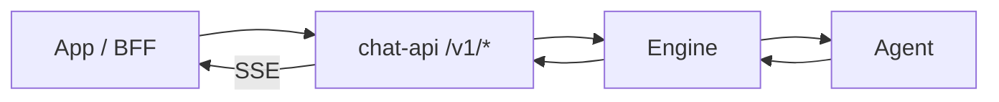

# chat-api Platform — API v1

> 版本：**v1.0.0**（2026-07-09）  
> 状态：已实现 — 与 `platform/chat-api` 对齐  
> 平台类型：`chat-api`（`[[projects.platforms]] type = "chat-api"`）  
> 设计说明：[chat-api 平台设计](./plans/2026-06-29-chat-api-platform-design.md)

## 1. 概述

`chat-api` 是 cc-connect 的一种 **Platform**，对外提供 HTTP + SSE API，供自定义 App / BFF 直连，无需开放 Management API。

**v1 能力**

- 会话列表、重命名、删除
- 会话历史（游标分页）
- 发送消息：**SSE 流式**（`message` → `thinking_delta?` → `text_delta` → `message_end`）
- 隐式创建会话（首条 `chat-messages` 不带 `conversation_id`）
- 会话忙时排队（默认 `busy_policy=queue`，复用 Engine 队列）



---

## 2. 基础约定

### 2.1 Base URL

默认 `listen_addr`（如 `:8030`），API 前缀 `path`（默认 `/v1/`）。

```text
https://api.example.com/v1/conversations
```

下文路径均相对于 API 前缀。

### 2.2 协议与编码

| 项 | 约定 |
|----|------|
| 非流式 REST | `application/json; charset=utf-8` |
| 流式聊天 | HTTP `200` + `text/event-stream`（**不是** JSON 信封） |
| 时间戳 | Unix **秒**（整数） |

REST 成功/失败使用 JSON 信封；`POST /chat-messages` 成功时 body 为 SSE。流内错误为 `event: error`（HTTP 仍为 200）。

### 2.3 响应信封

```json
{"ok": true, "data": { ... }}
{"ok": false, "error": "not found"}
```

### 2.4 认证与用户

两层身份：

| 层 | 方式 | 作用 |
|----|------|------|
| 服务 | `Authorization: Bearer <api_token>` | 调用方鉴权（BFF / 后端） |
| 终端用户 | `user` | 创建者 / 发送者 |
| 工作区频道 | `channel`（可选） | multi-workspace 绑定键；共享/隔离 `work_dir` |

> **生产环境必须配置 `api_token`（别名 `token`）。** 未配置时跳过 Bearer 校验。

平台不校验 `user` 归属；`api_token` 勿下发终端，由 BFF 鉴权后注入 `user`。

**会话模型**

| 概念 | 行为 |
|------|------|
| 创建 | 首条 `POST /chat-messages` 不带 `conversation_id` |
| 列表 | `GET /conversations` 仅返回该 user **创建**的会话 |
| 参与 | 持有 `conversation_id` 即可发消息、读历史（不必在列表中） |
| Engine | `session_key = {conversation_id}`（`conv_` 前缀随机 ID，不可猜测） |
| 工作区 | 可选 `channel` → `Message.ChannelKey`，供 Engine multi-workspace 解析 `work_dir`；未传则使用项目默认 `work_dir` |
| 管理 | 重命名 / 删除仅**创建者**（owner）可操作 |

`conversation_id` 与 `channel` **正交**：前者决定 agent 对话上下文，后者决定工作目录绑定（同 channel 下多个 conversation 可共享目录）。未传 `X-Chat-API-Channel` 时，chat-api 自动将项目默认 `work_dir` 绑定到内部默认 channel，无需额外配置。

**`user` 传递**

| 场景 | 需要 `user`？ | 方式 |
|------|---------------|------|
| `GET /conversations` | 是 | `user_header` 或 `?user=` |
| `GET …/messages` | 否 | `api_token` + `conversation_id` |
| `POST /chat-messages` | 是 | `user_header` |
| `PATCH` / `DELETE` | 是（须 owner） | `user_header` |
| `POST …/cancel` | 是（须发起者） | `user_header` |

默认 `user_header = X-Chat-API-User`，`user_name_header = X-Chat-API-User-Name`（可选，仅发消息），`channel_header = X-Chat-API-Channel`（可选，仅 `POST /chat-messages` 与 `POST …/cancel` 透传）。`user` 为 1–128 字符，`[a-zA-Z0-9_\-:.]+`；`channel` 为 1–256 字符，`[a-zA-Z0-9_\-:./]+`。

历史按轮次返回 `user_id` / `user_name`（有记录时）。v1 不返回 `owner_id`。

### 2.5 分页

| 参数 | 默认 | 说明 |
|------|------|------|
| `limit` | 20 | 1–100 |
| `cursor` | — | 上一页 `next_cursor` |
| `has_more` | — | 是否有下一页 |

会话列表按 `updated_at` 降序。消息历史首页为最新 N 条，向更早翻页。

### 2.6 常见错误

**REST**

| HTTP | `error` | 说明 |
|------|---------|------|
| 401 | `unauthorized` | Token 无效 |
| 400 | `user required` | 缺少 user |
| 400 | `invalid request` | 参数错误 |
| 404 | `not found` | 资源不存在或无权 |
| 409 | `conversation busy` | `busy_policy=reject` 时会话忙 |
| 413 | `payload too large` | 请求体 > 10 MiB |
| 500 | `internal error` | 服务器错误 |

**SSE**（`event: error`）

| `data.error` | 说明 |
|--------------|------|
| `canceled by user` | 用户取消 |
| `request timed out` | 超过 `request_timeout` |
| `too many concurrent requests` | 超过 `max_runs` |
| （队列满文案） | Engine 队列已满 |

### 2.7 message_id

```text
message_id = "{conversation_id}:{turn_index}"
```

`turn_index` 从 0 起，按完整 user→assistant 对递增。`event: message` 时即分配。未完成轮次不出现在历史中。

---

## 3. 数据模型

仅返回有值的字段。

### 3.1 Conversation

```json
{
  "id": "s1a2b3c",
  "name": "代码解释",
  "last_message_preview": "这段代码实现了……",
  "created_at": 1780000000,
  "updated_at": 1780003600
}
```

| 字段 | 说明 |
|------|------|
| `id` | `conversation_id` |
| `name` | 展示名称 |
| `last_message_preview` | 最后一条 history 摘要（≤200 rune）；无历史时省略 |
| `created_at` / `updated_at` | Unix 秒 |

### 3.2 Message

```json
{
  "id": "s1a2b3c:0",
  "query": "帮我解释这段代码",
  "answer": "这段代码实现了……",
  "created_at": 1780003500,
  "user_id": "user_001",
  "user_name": "Alice"
}
```

| 字段 | 说明 |
|------|------|
| `id` | 见 §2.7 |
| `query` / `answer` | 用户输入与助手完整回复 |
| `created_at` | 用户消息时间 |
| `user_id` / `user_name` | 该轮发送者（有记录时返回） |

`thinking_delta` 不写入历史。

### 3.3 发送消息

**请求体**

```json
{
  "conversation_id": "s1a2b3c",
  "query": "帮我解释这段代码",
  "inputs": [],
  "auto_generate_name": true,
  "metadata": {}
}
```

| 字段 | 必填 | 说明 |
|------|------|------|
| `conversation_id` | 否 | 省略则隐式创建 |
| `query` | 是 | 用户文本 |
| `inputs` | 否 | 多模态附件（§3.4）；历史不 replay |
| `auto_generate_name` | 否 | 默认 `true`；新会话首条后取 query 前 32 rune 为标题 |
| `metadata` | 否 | 传入 hooks，不进 prompt，不在响应中返回 |

`user` 由 header 提供，不在 body 中。

**SSE 响应**（`Accept: text/event-stream`、`*/*` 或省略）

```text
event: message
data: {"conversation_id":"s1a2b3c","message_id":"s1a2b3c:1","run_id":"run_abc"}

event: thinking_delta
data: {"message_id":"s1a2b3c:1","text":"分析代码结构…"}

event: text_delta
data: {"message_id":"s1a2b3c:1","text":"这段代码实现了……"}

event: message_end
data: {"message_id":"s1a2b3c:1","conversation_id":"s1a2b3c"}
```

| event | `data` | 说明 |
|-------|--------|------|
| `message` | `conversation_id`, `message_id`, `run_id` | 轮次开始 |
| `thinking_delta` | `message_id`, `text` | 推理增量（可选） |
| `text_delta` | `message_id`, `text` | 正文增量 |
| `message_end` | `message_id`, `conversation_id`, `answer?` | 轮次结束 |
| `message_queued` | `message_id`, `queue_depth` | 会话忙且 `busy_policy=queue` |
| `error` | `error` | 错误（§2.6） |

`message_end.answer` 默认省略（`include_answer_in_message_end = true` 时附带）。

隐式创建时 `conversation_id` 在 `message` 事件中返回。`busy_policy=reject` 且会话忙时返回 `409` JSON。

**客户端注意**

- 拼接 `text_delta` 得完整回复；断开 SSE **不**停止 agent，内容仍写入 history
- `message_queued` 后勿立即重开 SSE；等上轮结束或轮询 history
- 取消：`POST /runs/{run_id}/cancel`（`run_id` 来自 `message` 事件）

### 3.4 Input（多模态）

```json
{
  "type": "image",
  "transfer_method": "base64",
  "data": "<base64>",
  "mime_type": "image/png",
  "filename": "screenshot.png"
}
```

`transfer_method` 仅支持 `base64`。`type`：`image` | `file` | `audio`（audio 每请求最多一条）。

---

## 4. API 端点

示例省略 `Authorization: Bearer <api_token>`。

### 4.1 会话列表

```http
GET /conversations?limit=20
X-Chat-API-User: user_001
```

也支持 `?user=user_001`。

```json
{
  "ok": true,
  "data": {
    "limit": 20,
    "has_more": true,
    "next_cursor": "s0older",
    "conversations": [
      {
        "id": "s1a2b3c",
        "name": "代码解释",
        "last_message_preview": "这段代码实现了……",
        "created_at": 1780000000,
        "updated_at": 1780003600
      }
    ]
  }
}
```

### 4.2 重命名

```http
PATCH /conversations/{conversation_id}
X-Chat-API-User: user_001
Content-Type: application/json

{"name": "代码解释"}
```

须 owner。响应 `data`：`id`、`name`、`updated_at`。

### 4.3 删除

```http
DELETE /conversations/{conversation_id}
X-Chat-API-User: user_001
```

须 owner。`{"ok": true, "data": {"result": "success"}}`

### 4.4 历史消息

```http
GET /conversations/{conversation_id}/messages?limit=20
GET /conversations/{conversation_id}/messages?cursor=s1a2b3c:5&limit=20
```

持有 `conversation_id` 即可，不需要 `user`。

```json
{
  "ok": true,
  "data": {
    "limit": 20,
    "has_more": false,
    "messages": [
      {
        "id": "s1a2b3c:1",
        "query": "帮我解释这段代码",
        "answer": "这段代码实现了……",
        "created_at": 1780003500,
        "user_id": "user_001",
        "user_name": "Alice"
      }
    ]
  }
}
```

### 4.5 发送消息

```http
POST /chat-messages
X-Chat-API-User: user_001
X-Chat-API-User-Name: Alice
X-Chat-API-Channel: team-alpha/backend
Content-Type: application/json
Accept: text/event-stream
```

`X-Chat-API-Channel` 可选。省略时使用项目默认 `work_dir`；填写时写入 Engine `ChannelKey`，在 `mode = "multi-workspace"` 下参与工作区绑定。取消进行中的轮次时，若当时请求携带了 channel，cancel 会一并透传。

请求体与 SSE 见 §3.3。

| `busy_policy` | 行为 |
|---------------|------|
| `queue`（默认） | 入队；SSE 返回 `message_queued` 后关闭 |
| `reject` | `409`，`error`: `conversation busy` |

### 4.6 取消轮次

```http
POST /runs/{run_id}/cancel
X-Chat-API-User: user_001
```

`run_id` 来自 SSE `message` 事件。校验归属 user，否则 `404`。等同 Engine `/stop`，会话可继续发消息。

```json
{"ok": true, "data": {"result": "success"}}
```

SSE 仍连接时发送 `event: error`，`data.error` 为 `canceled by user`。

---

## 5. 接口清单

| 方法 | 路径 | 说明 |
|------|------|------|
| `GET` | `/conversations` | 列表 |
| `PATCH` | `/conversations/{id}` | 重命名 |
| `DELETE` | `/conversations/{id}` | 删除 |
| `GET` | `/conversations/{id}/messages` | 历史 |
| `POST` | `/chat-messages` | 发消息（SSE） |
| `POST` | `/runs/{run_id}/cancel` | 取消轮次 |

**v1 不提供**：`POST /conversations`、`response_mode=blocking`、历史附件 replay、`tool_call_*` SSE、`/health`。

---

## 6. 配置

```toml
[[projects.platforms]]
type = "chat-api"

[projects.platforms.options]
listen_addr = ":8030"
path = "/v1/"
api_token = "your-service-token"
user_header = "X-Chat-API-User"
user_name_header = "X-Chat-API-User-Name"
channel_header = "X-Chat-API-Channel"
cors_origins = ["https://app.example.com"]
request_timeout = "30m"
busy_policy = "queue"
include_answer_in_message_end = false
max_runs = 1000
run_ttl = "2h"
```

| 选项 | 默认 | 说明 |
|------|------|------|
| `listen_addr` / `listen` | `:8030` | 监听地址 |
| `path` | `/v1/` | API 前缀 |
| `api_token` / `token` | 空 | Bearer token；空则跳过认证 |
| `user_header` | `X-Chat-API-User` | 终端 user header |
| `user_name_header` | `X-Chat-API-User-Name` | 可选显示名 header |
| `channel_header` | `X-Chat-API-Channel` | 可选工作区 channel header |
| `cors_origins` | 空 | CORS 允许来源 |
| `request_timeout` / `timeout` | `30m` | SSE 等待上限 |
| `busy_policy` | `queue` | `queue` 或 `reject` |
| `include_answer_in_message_end` | `false` | `message_end` 是否附带 answer |
| `max_runs` | `1000` | 内存 pending run 上限 |
| `run_ttl` | `2h` | run 记录 TTL |

会话持久化由 Engine `sessions.json` 承担；`pendingStore` 为进程内内存态。

---

## 7. 版本历史

| 版本 | 日期 | 说明 |
|------|------|------|
| v1.0.0 | 2026-07-09 | 精简规范；新增可选 `X-Chat-API-Channel` |
| v1.0.0-draft | 2026-06-29 | 初版：6 端点、SSE-only、queue 默认 |
