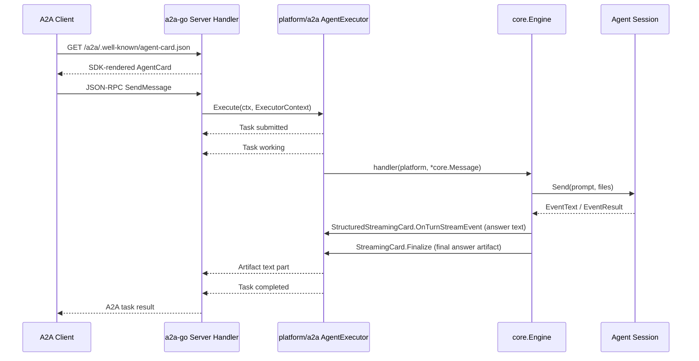

# A2A Platform Design

## Goal

Add A2A server protocol support as a first-class cc-connect platform. External A2A clients can discover the AgentCard and call the configured cc-connect coding agent through the official A2A JSON-RPC Task model.

## Scope

This design implements inbound A2A server support through `github.com/a2aproject/a2a-go/v2`:

- AgentCard discovery.
- JSON-RPC `SendMessage` through the SDK request handler.
- SDK-managed `GetTask` and `CancelTask` behavior.
- Optional Bearer token authentication through an SDK call interceptor.
- Text, Data, Raw, and URL parts mapped into cc-connect messages.

Out of scope for the first implementation:

- Outbound A2A client/tool support.
- Push notifications.
- Streaming subscribe endpoints.
- Persisting task state across process restarts.

## Architecture

`platform/a2a` is a local HTTP server platform. It implements `core.Platform`, registers as `a2a`, and uses `a2asrv.NewHandler` plus `a2asrv.NewJSONRPCHandler` for protocol handling. The platform does not hand-roll JSON-RPC envelopes, AgentCard schema, or A2A Task state transitions.

The package implements `a2asrv.AgentExecutor`. `Execute` converts the inbound SDK `ExecutorContext` into a `core.Message`, dispatches it to `core.Engine`, then waits for cc-connect to return the final answer. Completion is signaled primarily through `core.StreamingCardPlatform`: `CreateStreamingCard` returns a task-backed handle, `Update` is treated as progress, and `Finalize` completes the pending A2A result. `Reply` and `Send` remain fallback completion paths.



`platform/a2a` implements `core.StructuredStreamingCard`: mid-turn progress is
answer (or thinking) text only — not the Engine markdown card with `💭` / `🔧`
markers. Legacy `Update(string)` remains for unit tests that do not emit typed events.

## Configuration

Example:

```toml
[[projects.platforms]]
type = "a2a"

[projects.platforms.options]
listen_addr = ":8010"
path = "/a2a/"
public_url = "https://agent.example.com"
api_token = "optional-bearer-token"
user_header = "X-A2A-User"
agent_name = "cc-connect"
description = "cc-connect A2A bridge"
agent_version = "v10.0.0"
timeout = "30m"
task_ttl = "2h"
max_tasks = 1000

[[projects.platforms.options.skills]]
id = "code-review"
name = "Code Review"
description = "Review code changes and suggest fixes."
tags = ["code", "review"]
examples = ["Review this pull request"]
input_modes = ["text/plain"]
output_modes = ["text/plain"]
```

Fields:

| Option | Required | Default | Description |
|--------|----------|---------|-------------|
| `listen_addr` | No | `:8010` | HTTP listen address. Alias: `listen` |
| `path` | No | `/a2a/` | JSON-RPC base path and AgentCard prefix |
| `public_url` | No | empty | External base URL used in AgentCard. If empty, derive from request headers |
| `api_token` | No | empty | If set, require `Authorization: Bearer <token>`. Alias: `token` |
| `user_header` | No | `X-A2A-User` | HTTP header used as the cc-connect message user id. This is a cc-connect extension, not an A2A protocol field |
| `agent_name` | No | `CC-Connect` | AgentCard display name |
| `description` | No | generic description | AgentCard description. Alias: `agent_description` |
| `agent_version` | No | cc-connect version or `dev` | AgentCard version |
| `timeout` | No | `30m` | Maximum time the executor waits for the cc-connect result. Alias: `request_timeout` |
| `task_ttl` | No | `2h` | How long an in-flight cc-connect bridge waiter can remain pending |
| `max_tasks` | No | `1000` | Maximum number of in-flight A2A tasks waiting for cc-connect completion |
| `skills` | No | default bridge skill | AgentCard skills advertised to A2A clients |
| `forward_headers` | No | empty | Whitelist of HTTP header names exposed to cc-connect hooks as `headers` / `CC_HOOK_HEADERS_JSON`. Not sent to the coding agent. `Authorization` / `Cookie` are always blocked |

## Endpoints

For `path = "/a2a/"`:

- `GET /a2a/.well-known/agent-card.json`
- `POST /a2a/`

The JSON-RPC endpoint is served by `a2a-go/v2`, which keeps method names and response shapes aligned with the SDK version in `go.mod`.

## AgentCard

The AgentCard is built with SDK types and served by a dynamic HTTP handler so the advertised JSON-RPC URL can be derived from the incoming request when `public_url` is not configured. It advertises:

- `supportedInterfaces` containing a JSON-RPC interface at `public_url + path`, or a request-derived URL.
- Name, description, and version from config.
- Default text/plain output and text/data/raw-compatible input modes.
- Configured skills from `[[projects.platforms.options.skills]]`, or a default cc-connect bridge skill when omitted.

Configured skills require `id`, `name`, and `description`. Optional fields are `tags`, `examples`, `input_modes`, and `output_modes`.

Request-derived URLs trust headers in this order: `Forwarded`, `X-Forwarded-Proto` plus `X-Forwarded-Host`, `Host`, then the local listen address fallback.

False boolean capabilities such as `streaming` and `pushNotifications` are omitted by the SDK JSON tags.

## Task Model

The A2A Task model is owned by the SDK. The executor emits SDK events:

| Event | Meaning |
|-------|---------|
| `NewSubmittedTask` | Request accepted by the SDK executor |
| `TaskStateWorking` | cc-connect dispatch has started |
| `TaskArtifactUpdateEvent` | Final cc-connect text result |
| `TaskStateCompleted` | Task completed successfully |
| `TaskStateFailed` | Parsing, engine readiness, timeout, or cancellation error |
| `TaskStateCanceled` | Client requested cancellation |

`platform/a2a` only keeps a process-local pending-result map keyed by A2A task ID. This map bridges the asynchronous cc-connect engine callback back into the synchronous SDK executor event stream.

## Message Mapping

Inbound A2A message parts map to cc-connect fields:

| A2A Part | cc-connect mapping |
|----------|--------------------|
| Text | Append to `Message.Content` |
| Data | Marshal to compact JSON and append to `Message.Content` |
| Raw inline bytes | `Message.Files` |
| URL | Append a `File URL: ...` line to `Message.Content` |

The cc-connect message uses:

- `Platform = "a2a"`
- `SessionKey = "a2a:" + contextId`, falling back to task id when context id is absent
- `MessageID = message.messageId`
- `ChannelID = contextId`
- `ChannelKey = contextId`
- `ReplyCtx = replyContext{taskID, sessionKey}`
- `UserID = ExecutorContext.User.Name` when available, otherwise `a2a`
- Hook context includes merged `SendMessageRequest.metadata` and `message.metadata` as `ctx`, plus whitelisted inbound HTTP headers as `headers`; the coding agent prompt is unchanged

## Reply Mapping

The preferred completion path is `core.StreamingCardPlatform`:

- `CreateStreamingCard` validates the A2A reply context.
- `Update` is progress only and does not complete the task.
- `Finalize` records the final text that becomes the A2A artifact.

`Reply` completes a task when it receives the A2A reply context. `Send` also supports a string task ID as a fallback for non-standard engine paths.

## Cancellation

`Cancel` completes the pending result with a canceled state and emits `TaskStateCanceled`. Cancellation is best effort because `core.Engine` does not yet expose an active interruption hook for an in-flight agent turn.

## Errors

Protocol-level JSON-RPC errors are generated by the SDK. The platform maps adapter errors into failed task status events. Runtime logs use `slog`; configured bearer tokens must not be logged.

## Testing Strategy

Unit tests cover:

- Config defaults, aliases, and validation.
- SDK AgentCard endpoint shape.
- Pending result completion exactly once.
- `StreamingCard.Update` not completing the task.
- `StreamingCard.Finalize` completing with the final artifact.

Follow-up tests should cover full SDK `SendMessage` HTTP dispatch and timeout behavior.

## Build Integration

Add or verify:

- `platform/a2a/`
- `cmd/cc-connect/plugin_platform_a2a.go`
- `no_a2a` build tag support
- `a2a` in `ALL_PLATFORMS`
- `config.example.toml` example
- `docs/a2a.md`

Core remains platform-agnostic. No A2A-specific logic is added to `core`.
