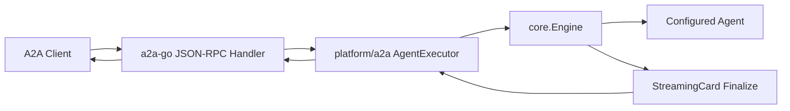

# A2A Platform Implementation Plan

## Goal

Add inbound A2A server support as a cc-connect platform using `github.com/a2aproject/a2a-go/v2` for AgentCard, JSON-RPC, and Task semantics.

## Current Architecture

`platform/a2a` should be a thin adapter around the official SDK:

- HTTP server lifecycle is owned by the platform.
- AgentCard is built with SDK `a2a.AgentCard` types and served by a dynamic HTTP handler.
- JSON-RPC is served by `a2asrv.NewJSONRPCHandler`.
- cc-connect integration lives in an `a2asrv.AgentExecutor` implementation.
- A package-local pending map only bridges cc-connect finalization back into the SDK executor stream; it is not an A2A protocol TaskStore.



## Task 1: SDK Dependency and API Confirmation

Files:

- `go.mod`
- `go.sum`

Steps:

1. Add `github.com/a2aproject/a2a-go/v2`.
2. Confirm SDK APIs with `go doc`:
   - `a2asrv.AgentExecutor`
   - `a2asrv.ExecutorContext`
   - `a2asrv.NewHandler`
   - `a2asrv.NewJSONRPCHandler`
   - `a2a.AgentCard`
   - `a2a.Message`
   - `a2a.Part`
3. Run `go mod tidy` after implementation imports are in place.

Verification:

```bash
go test ./platform/a2a
```

## Task 2: Platform Skeleton and Config

Files:

- `platform/a2a/a2a.go`
- `platform/a2a/a2a_test.go`

Tests:

- `New` applies defaults.
- `New` supports aliases used by earlier docs: `listen`, `token`, `agent_description`, `request_timeout`.
- `New` validates malformed paths.
- `Name()` returns `a2a`.

Defaults:

- `listen_addr = ":8010"`
- `path = "/a2a/"`
- `timeout = 30m`
- `task_ttl = 2h`
- `max_tasks = 1000`

## Task 3: SDK AgentCard Endpoint

Files:

- `platform/a2a/a2a.go`
- `platform/a2a/a2a_test.go`

Implementation:

- Create `agentCard(endpointURL string) *a2a.AgentCard`.
- Serve `GET <path>.well-known/agent-card.json` with a dynamic handler.
- Use `a2a.NewAgentInterface(endpointURL, a2a.TransportProtocolJSONRPC)`.
- If `public_url` is empty, derive endpoint URL from `Forwarded`, `X-Forwarded-*`, `Host`, then local listen fallback.

Tests:

- HTTP 200.
- JSON includes configured name, description, version.
- `supportedInterfaces[0].url` is `public_url + path`, or the request-derived URL when `public_url` is empty.
- `supportedInterfaces[0].protocolBinding` is `JSONRPC`.
- False capability fields may be omitted by SDK `omitempty` behavior.

## Task 4: SDK JSON-RPC Routing and Auth

Files:

- `platform/a2a/a2a.go`
- `platform/a2a/a2a_test.go`

Implementation:

- Build a request handler with `a2asrv.NewHandler(&sdkExecutor{platform: p})`.
- Serve it with `a2asrv.NewJSONRPCHandler` at `path`.
- Add an SDK `CallInterceptor` controlled by `api_token` or `token`.
- Set `CallContext.User` from `X-A2A-User`, falling back to `a2a`.

Tests:

- No token accepts JSON-RPC requests.
- Missing or wrong Bearer is rejected when token is configured.
- Valid Bearer reaches SDK handler and exposes an authenticated SDK user.

## Task 5: AgentExecutor Bridge

Files:

- `platform/a2a/a2a.go`
- `platform/a2a/a2a_test.go`

Implementation:

- Implement `Execute(ctx, execCtx)` as an SDK event iterator.
- Emit submitted when the SDK has no stored task.
- Create a pending waiter keyed by `execCtx.TaskID`.
- Convert `execCtx.Message.Parts` into `core.Message.Content` and `core.Message.Files`.
- Dispatch `p.handler(p, *core.Message)` in a goroutine.
- Emit working, wait for pending completion, then emit artifact and completed.
- Emit failed status on parse errors, missing handler, timeout, or context cancellation.

Tests:

- Text/Data/Raw/URL part mapping.
- Handler receives platform `a2a`, context-based session key, message id, channel id, user id, and reply context.
- `SessionKey` is `a2a:<contextId>` and falls back to task id when context id is absent.
- Timeout becomes failed task status.

## Task 6: StreamingCard and Fallback Completion

Files:

- `platform/a2a/a2a.go`
- `platform/a2a/a2a_test.go`

Implementation:

- Implement `core.StreamingCardPlatform`.
- `CreateStreamingCard` validates `replyContext{taskID}`.
- `Update` is a no-op/progress hook for v1.
- `Finalize` completes the pending task with final text.
- `Reply` completes when called with the A2A reply context.
- `Send` supports a string task id fallback.
- Invalid reply/send contexts return contextual errors instead of silently dropping output.

Tests:

- Pending result completes exactly once.
- `Update` does not complete.
- `Finalize` completes with final content.
- `Reply` and `Send` fallback behavior.

## Task 7: Cancellation and Lifecycle

Files:

- `platform/a2a/a2a.go`
- `platform/a2a/a2a_test.go`

Implementation:

- `Cancel` emits `TaskStateCanceled` and resolves the pending waiter with a canceled state.
- `Start` creates the HTTP server, stores the handler, starts serving in goroutines, and logs with `slog`.
- `Stop` cancels background context and gracefully shuts down the server.
- Handler access is protected from races because SDK requests can execute concurrently with platform lifecycle operations.

Tests:

- `Start` stores handler and starts idempotently.
- `Stop` shuts down server.
- Cancel resolves pending work.

## Task 8: Build Integration

Files:

- `cmd/cc-connect/plugin_platform_a2a.go`
- `Makefile`
- `CLAUDE.md`
- `AGENTS.md`
- `config.example.toml`
- `docs/a2a.md`

Implementation:

- Add plugin import guarded by `//go:build !no_a2a`.
- Add `a2a` to platform build lists.
- Add `no_a2a` to documented tags.
- Add a config example using SDK-aligned option names.
- Add user documentation with AgentCard URL and JSON-RPC examples.

Verification:

```bash
go test ./platform/a2a
go test -tags no_a2a ./cmd/cc-connect
```

Use `no_web` only if web assets are absent in the local environment.

## Task 9: Local A2A Verification

Start cc-connect with an A2A platform config, then validate:

```bash
curl http://127.0.0.1:8010/a2a/.well-known/agent-card.json
```

Then use `a2a-server-check` local mode against:

```text
http://127.0.0.1:8010/a2a/
```

Expected:

- AgentCard HTTP 200.
- `SendMessage` HTTP 200.
- Task reaches completed or failed with SDK-shaped A2A status.

## Commit Plan

Use small commits if implementing interactively:

1. `feat a2a add sdk platform adapter`
2. `feat a2a wire sdk executor task flow`
3. `docs a2a document sdk platform setup`

Do not use English colons in commit messages.
