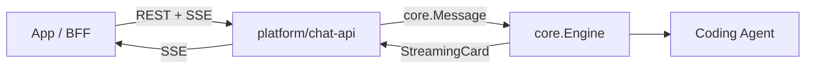

# chat-api Platform Design

> Version: 2026-06-29 draft  
> Status: API v1.0.0 — implemented in `platform/chat-api`  
> Public API: [chat-api.zh-CN.md](../chat-api.zh-CN.md)

## Goal

`platform/chat-api` exposes a slim HTTP + SSE client API for custom apps and BFFs, without opening Management API.

## Architecture



Implements `core.Platform`, `StreamingCardPlatform`, `HookContextProvider` — same in-process pending pattern as `platform/a2a`. Does **not** use Bridge WebSocket.

## Session mapping

| API | cc-connect |
|-----|------------|
| `user`（创建者 / 发送者） | 列表归属 `chat-api:{user}`；`Message.UserID` |
| `user_name`（可选 header） | `Message.UserName` + 历史 `HistoryEntry` |
| `channel`（可选 header） | `Message.ChannelKey` / `ChannelID`；multi-workspace 下按 `<base_dir>/<channel>` 约定匹配；未传则使用默认 `work_dir` |
| `conversation_id` | `Session.ID`（`conv_` + 22 字符随机串）；Engine `session_key = chat-api:{channel}:{conversation_id}` |
| `message_id` | `{conversation_id}:{turn_index}` |
| History | 相邻 `user` + `assistant` 配对 |

- **List**: `ListSessions("chat-api:{owner}")` — 仅创建者可见
- **Participate**: `FindByID(conversation_id)` — 任意知情 user 可发消息 / 读历史
- **Create**: 隐式 `NewSession(chat-api:{creator})` on first message
- **Persist**: Engine `sessions.json`
- **Default workspace**: no `channel` header uses the project default `work_dir` via an internal workspace binding (no extra config)

## Busy session policy

Default `busy_policy = "queue"` — delegate to `Engine.handleMessage` → `queueMessageForBusySession`.

- Engine queues metadata; sends to **same** `agentSession` after current turn `EventResult` (no mid-turn stdin injection).
- chat-api responds with SSE `message_queued` and closes the HTTP stream.
- Optional `busy_policy = "reject"` → `409` without queueing.

Do **not** duplicate TryLock logic in chat-api; let Engine own queue semantics.

## Streaming (v1)

- Normative SSE: `message`, `thinking_delta`, `tool_call`, `tool_result`, `text_delta`, `permission_request`, `question_request`, `interaction_superseded`, `interaction_ack`, `ping`, `message_end`, `error`, `message_queued`
- `StreamingCard.Update` → `thinking_delta` + `tool_call` + `text_delta` (parsed from card markdown); `Finalize` → `message_end`
- `Reply` tool-result fallback (`🧾` …) → `tool_result` (not `text_delta`)
- Permission / AskUserQuestion → `InlineButtonSender` / interactive `CardSender` → SSE interaction events
- Client responds via `POST /runs/{run_id}/interactions/{id}/respond` with public `decision` / `option_id(s)` / `answer`; same SSE continues
- SSE `actions[].id` uses the same public IDs (`allow` / `0:1`); Engine `perm:` / `askq:` IDs stay internal for respond validation
- One unresolved interaction per run; a newer prompt emits `interaction_superseded` then the new request event
- `interaction_timeout` (default `10m`): permission timeout auto-`deny`; AskUserQuestion timeout cancels the blocked turn (`error.kind=question`)
- `sse_ping_interval` (default `15s`): keepalive while SSE is open
- `pendingStore` per run (from `platform/a2a`); single-process only
- Client disconnect → detach SSE only; agent turn continues; partial text still saved to history

Tool SSE details: [2026-07-15-chat-api-tool-sse-design.md](./2026-07-15-chat-api-tool-sse-design.md).
Interaction details: [2026-07-14-chat-api-interaction-hardening.md](./2026-07-14-chat-api-interaction-hardening.md).

**Deferred**: `response_mode=blocking`, optional SSE extensions (`agent_thought`, business `metadata` events).

## Authentication

- `Authorization: Bearer <api_token>` when configured (`token` alias supported). **If unset, auth is skipped — not for production.**
- End-user `user` only via `user_header` on writes; reads allow query `user=` OR header
- Optional display name via `user_name_header` (default `X-Chat-API-User-Name`); persisted per user history entry as `user_id` / `user_name`
- Platform does not verify user ownership — BFF must authenticate first
- `conversation_id` acts as a capability token for read/post

## HTTP surface (v1)

| Method | Path |
|--------|------|
| `GET` | `/v1/conversations` |
| `PATCH` | `/v1/conversations/{id}` |
| `DELETE` | `/v1/conversations/{id}` |
| `GET` | `/v1/conversations/{id}/messages` |
| `POST` | `/v1/chat-messages` |
| `POST` | `/v1/runs/{run_id}/cancel` |
| `POST` | `/v1/runs/{run_id}/interactions/{interaction_id}/respond` |

Response envelope: `{ok, data}` / `{ok, error}` (Bridge style).

Pagination: unified `cursor` + `next_cursor` + `has_more`.

**Disconnect vs cancel**: SSE disconnect detaches the stream only; the agent turn keeps running. Use `POST /v1/runs/{run_id}/cancel` for user-initiated abort (`Engine.StopInteractiveTurn`).

**Interaction confirmations**: Engine `SendWithButtons` / interactive cards emit `permission_request` / `question_request`. Client POSTs the choice to the respond endpoint; chat-api injects a synthetic `core.Message` (permission paths set `IsPermissionResponse`). Interaction replies must not finish the SSE turn as a plain reply.

## Building blocks

### Reuse

| Need | Source |
|------|--------|
| Session CRUD | `SessionManager` |
| Dispatch + queue | `Engine.handleMessage` |
| Attachments | `core.Message` fields |
| Streaming | `platform/a2a` StreamingCard + pendingStore |
| Hooks | `HookContextProvider` |
| HTTP auth / CORS | Bridge / Management middleware patterns |

### Build in `platform/chat-api`

| Need | Notes |
|------|-------|
| Cursor pagination | Over sorted sessions / paired messages |
| query/answer pairing | View layer over `GetHistory` |
| SSE writer | Maps StreamingCard to HTTP |
| Ownership checks | list/rename/delete: owner only; messages: `FindByID` |

## v1 limitations

| Item | Behavior |
|------|----------|
| Conversation / message `metadata` | Not in API responses; hooks-only on send |
| Historical attachments | Not replayed |
| `auto_generate_name` | Truncate first `query` (32 runes), no LLM |
| Blocking JSON | BFF aggregates SSE or wait for v1.1 |
| `owner_id` | Not exposed; owner implied by list membership |
| `max_runs` / `run_ttl` | In-memory pending run limits (default 1000 / 2h) |
| Horizontal scale | Single-process pending store; no multi-replica run sharing in v1 |

## Package layout

```
platform/chat-api/
  chatapi.go
  conversations.go
  messages.go
  chat.go
  interaction.go
  workspace.go
  auth.go
  sse.go
  chatapi_test.go
  interaction_test.go
  workspace_test.go
  e2e_local_test.go
cmd/cc-connect/plugin_platform_chatapi.go
```

## Registry

```go
core.RegisterPlatform("chat-api", New)
```

Add to `ALL_PLATFORMS` in Makefile and `config.example.toml`.

## Testing

- Cursor pagination, message_id stability, SSE framing
- Implicit conversation create
- `message_queued` when busy + `busy_policy=queue`
- `409` when `busy_policy=reject`
- Optional CUJ: two conversations, history preserved after switch

## vs Bridge / Management

| Capability | Bridge | Management | chat-api v1 |
|------------|--------|------------|-------------|
| Session list | per `session_key` | all sessions | per `user` |
| Stream | WebSocket | — | SSE |
| Send | WS / adapter | async `/send` | SSE on same POST |
| Busy | queue (IM) | — | queue (default) |
| Public-safe | adapter model | admin | yes |
