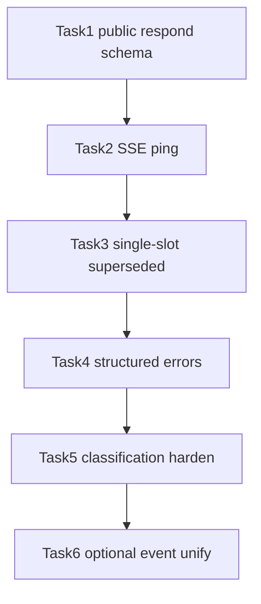

# chat-api Interaction Hardening Implementation Plan

> **For Claude:** REQUIRED SUB-SKILL: Use superpowers:executing-plans to implement this plan task-by-task.

**Goal:** Harden chat-api confirmation windows without changing core: stable public respond API, SSE keepalive, single-slot interaction rules, clearer errors.

**Architecture:** Keep the unified hang-SSE + `POST .../interactions/{id}/respond` model. Chat-api owns mapping between a stable public JSON schema and Engine-private `perm:` / `askq:` payloads. Heartbeats are platform-local on the pending SSE writer. Interaction supersession and timeout payloads stay inside `platform/chat-api`.

**Tech Stack:** Go `platform/chat-api`, `httptest`, existing SSE writer / pendingStore, docs in `docs/chat-api.zh-CN.md` + this plan.

**Scope:** `platform/chat-api/**` + docs only. Do **not** change `core/`.

**Non-goals (this plan):** multi-replica pending store; merging SSE event names into a single `interaction` event (optional follow-up Task 6); two-phase SSE for questions.

---

## Target Protocol

### Respond body (public)

Exactly one of:

```json
{"decision":"allow"}          // allow | deny | allow_all
{"option_id":"0:1"}          // single select (maps to askq:0:1)
{"option_ids":["0:1","0:3"]} // multi-select (maps to Engine "1,3")
{"answer":"自由文本"}
```

Legacy `action` / `actions` are intentionally not supported. The public schema is small enough that keeping both forms is not worth the extra API surface.

### SSE heartbeat

While a run SSE is open, every `sse_ping_interval` (default `15s`) emit:

```text
event: ping
data: {"run_id":"run_abc","ts":1780004100}
```

Or SSE comment `: ping\n\n` if we want smaller wire size — prefer named `ping` event for client parseability.

Config: `sse_ping_interval` (duration, default `15s`; `0` disables).

### Single-slot rule

At most one unresolved interaction per run. New `emitInteraction` must:

1. Mark previous interaction expired/superseded (stop its timer)
2. Enqueue `interaction_superseded` with old `interaction_id` + new `interaction_id`
3. Install the new interaction + timer

Responding with the old id → `404` / `409 interaction expired`.

### Timeout / error shape

SSE `error` payload for interaction timeout:

```json
{"error":"interaction timed out","kind":"permission","decision":"deny"}
{"error":"interaction timed out","kind":"question"}
```

Permission path still auto-deny into Engine **before** or **instead of** immediate terminal error — keep current behavior: auto-deny continues the turn; question timeout cancels and ends SSE with the structured error above.

Respond REST errors (replace bare `invalid request` where possible):

| case | status | error |
|------|--------|-------|
| mixed/missing fields | 400 | `exactly one of decision, option_id, option_ids, answer required` |
| bad decision | 400 | `invalid decision` |
| unknown option | 400 | `unknown option` |
| already responded | 409 | `interaction already responded` |
| expired | 409 | `interaction expired` |

---

### Task 1: Failing tests for public respond schema

**Files:**
- Modify: `platform/chat-api/interaction_test.go`
- Modify: `platform/chat-api/interaction.go` (later)

**Step 1: Write failing unit tests**

Add:

```go
func TestNormalizeInteractionResponse_PublicDecision(t *testing.T) { ... }
func TestNormalizeInteractionResponse_PublicOptionIDs(t *testing.T) { ... }
func TestNormalizeInteractionResponse_RejectsMixedNewAndLegacy(t *testing.T) { ... }
```

Assert:

- `decision=allow` → content `allow`, `isPerm=true`
- `option_ids=["0:1","0:3"]` on question with matching actions → `1,3`
- mixing `decision` + `action` → error

**Step 2: Run to verify fail**

```bash
go test ./platform/chat-api -run 'TestNormalizeInteractionResponse_Public' -count=1 -v
```

Expected: FAIL (fields not implemented).

**Step 3: Minimal implement in `normalizeInteractionResponse`**

Extend `interactionRespondRequest`:

```go
type interactionRespondRequest struct {
	Decision  string   `json:"decision"`
	OptionID  string   `json:"option_id"`
	OptionIDs []string `json:"option_ids"`
	Answer    string   `json:"answer"`
}
```

Map:

- `decision` → `allow` / `deny` / `allow all`
- `option_id` `"q:opt"` or `"0:1"` → internal `askq:…` then reuse existing path
- `option_ids` → numbered list via existing `optionIndexFromAskq`

**Step 4: Pass**

```bash
go test ./platform/chat-api -run 'TestNormalizeInteractionResponse|TestPermission|TestAskQuestion' -count=1
```

**Step 5: Update docs §4.7** in `docs/chat-api.zh-CN.md` + design note in `docs/plans/2026-06-29-chat-api-platform-design.md`

**Step 6: Commit** (only if user asks)

Message sketch: `feat(chat-api) stabilize interaction respond public schema`

---

### Task 2: SSE ping heartbeat

**Files:**
- Modify: `platform/chat-api/chat.go` (SSE loop)
- Modify: `platform/chat-api/chatapi.go` / `New` options
- Modify: `platform/chat-api/sse.go` (optional `Ping()` helper)
- Modify: `config.example.toml`
- Test: `platform/chat-api/interaction_test.go` or new `sse_test.go`

**Step 1: Failing test**

Start a hang-SSE (permission ready, not released). Assert within ~timeout that body contains `event: ping` (use short `sse_ping_interval=20ms` in test opts).

**Step 2: Implement**

- Parse `sse_ping_interval` (default `15s`)
- In `handleChatMessages` select loop, add ticker; on tick `run.enqueueEvent("ping", …)` or write comment if detached=false
- Stop ticker when run completes

**Step 3: Docs** — client note under §3.3: treat `ping` as keepalive, ignore for UI

**Step 4: Verify**

```bash
go test ./platform/chat-api -run 'Ping|PermissionRequest' -count=1
```

---

### Task 3: Single-slot + `interaction_superseded`

**Files:**
- Modify: `platform/chat-api/interaction.go` (`emitInteraction`)
- Modify: `platform/chat-api/run.go`
- Test: `platform/chat-api/interaction_test.go`
- Docs: `docs/chat-api.zh-CN.md` §3.5 event table

**Step 1: Failing test**

Handler emits two permission prompts on same ReplyCtx. Assert SSE has:

1. first `permission_request`
2. `interaction_superseded` with old id
3. second `permission_request`

Responding to first id after supersession → 404 or 409 expired.

**Step 2: Implement**

In `emitInteraction`, if active unresolved interaction exists:

```go
oldID := ...
run.markInteractionExpired(oldID) // or dedicated supersede
run.enqueueEvent("interaction_superseded", map[string]any{
  "interaction_id": oldID,
  "replacement_id": ixID,
  "run_id": runID,
  "message_id": run.messageID,
})
```

Then install new interaction as today.

**Step 3: Verify + docs**

---

### Task 4: Structured timeout / better REST errors

**Files:**
- Modify: `platform/chat-api/interaction.go` (`onInteractionTimeout`, `handleRespondInteraction`)
- Modify: `platform/chat-api/chat.go` (`emitTerminalSSE` if needed)
- Modify: `platform/chat-api/run.go` (carry kind on timeout result)
- Tests + docs §2.6 / §3.5

**Step 1: Tests**

- Question timeout SSE error JSON includes `"kind":"question"`
- Bad respond body returns specific `error` string (not only `invalid request`)

**Step 2: Implement**

- Extend `pendingResult` or SSE error map with `kind` / `decision`
- Plumb `normalize` errors to HTTP body verbatim (safe static strings only)

**Step 3: Verify**

```bash
go test ./platform/chat-api -count=1
```

---

### Task 5: Harden classification (chat-api only)

**Files:**
- Modify: `platform/chat-api/interaction.go` (`emitCardInteraction`)
- Test: `platform/chat-api/interaction_test.go`

**Problem:** no-buttons + non-empty RenderText currently becomes `interactionQuestion`.

**Step 1: Failing test**

Plain markdown card without `askq` / list buttons → must go through `Reply` text, **not** `question_request`.

**Step 2: Narrow heuristic**

Only treat as question when:

- `classifyButtons` finds `askq:`, OR
- card text matches Engine ask-question markers already used elsewhere (prefer detecting numbered options / known AskUserQuestion layout if already present in card elements)

If uncertain → plain `Reply`, never invent confirmation.

**Step 3: Verify + document limitation** in §3.5: multi-select free-text cards without structured actions fall back to text unless Engine emits askq buttons.

---

### Task 6 (optional follow-up): Unify SSE event name

**Defer unless product asks.**

Emit `event: interaction` with `"kind":"permission"|"question"` while still also emitting `permission_request` / `question_request` for one release (dual-write), then deprecate duplicates in docs.

Not required for hardening completeness.

---

## Implementation Order



Ship after Task 4 for a coherent API bump; Task 5 can land same PR; Task 6 separate.

## Verification Gate (every task)

```bash
gofmt -w platform/chat-api/*.go
go test ./platform/chat-api -count=1
```

Docs must match code before considering a task done (`docs/chat-api.zh-CN.md`).

## Risk Notes

- Unknown legacy fields are ignored by JSON decoding and then rejected as a missing public response field.
- Heartbeat under load: one ticker per run is fine at `max_runs=1000`; document cost.
- Superseded interactions: Engine still only tracks one pending permission; chat-api must not leave two live respondable IDs.
