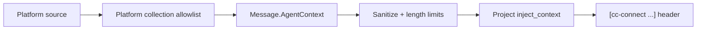

# Agent Context Injection Design

Date: 2026-07-15

## Goal

Support per-turn custom context injection for agents, for example:

- Slack sender email (existing `UserEmail` + `inject_sender`)
- chat-api personalized headers: language, task id, tenant id, etc.

Context must be collected at the platform boundary, allowlisted twice
(platform collection + project injection), and rendered uniformly by Engine.

## Decisions

| Decision | Choice |
|----------|--------|
| Lifetime | Every turn (message-scoped), not session creation only |
| Carrier | `Message.AgentContext` |
| Persistence | Not stored on `Session` / history / API responses |
| Field model | Typed standard fields + allowlisted `custom.<slug>` |
| Prompt formatting | Engine owns `[cc-connect ...]` attribute rendering |
| Language semantics | Agent hint only; does **not** change Engine UI i18n |
| chat-api body `metadata` | Remains hooks-only (unchanged v1 contract) |

## Data model

```go
type AgentContext struct {
    Language string            // BCP47-like hint for the agent
    TaskID   string
    TraceID  string
    Custom   map[string]string // keys must match custom.<slug>
}
```

Sender identity continues to use existing Message fields
(`UserID` / `UserName` / `UserEmail`) and project `inject_sender`.

## Dual allowlists



### Project config

```toml
inject_context = ["language", "task_id", "trace_id", "custom.*"]
# or specific custom keys:
# inject_context = ["language", "task_id", "custom.tenant_id"]
```

Empty / omitted `inject_context` means no AgentContext fields enter the agent
prompt (sender/timestamp injection remain independently controlled).

### chat-api platform config

```toml
[projects.platforms.options.agent_context_headers]
language = "X-Language"
task_id = "X-Task-ID"
trace_id = "X-Trace-ID"
"custom.tenant_id" = "X-Tenant-ID"
```

- Only mapped headers are read.
- Mapped header names are added to CORS `Access-Control-Allow-Headers`.
- Unknown inbound headers are ignored.
- Sensitive headers (`Authorization`, `Cookie`, …) cannot be mapped.

## Rendering & safety

Engine merges selected context attrs into the same `[cc-connect ...]` line as
sender/timestamp (when enabled):

```text
[cc-connect sender_id=U1 platform=slack chat_id=C1 language="zh" task_id="t1" custom.tenant_id="acme"]
user text
```

Rules:

- Validate / sanitize before render (strip controls, quote escaping, max length 128).
- Custom keys must match `custom.[a-z][a-z0-9_]{0,31}`.
- Max 16 custom keys.
- Stable attribute order for deterministic tests.
- Invalid fields: `slog.Warn` with key/reason only (never values), message continues.
- History stores raw `msg.Content` only — inject header is agent-visible, not user history.

## Queueing

`queuedMessage` clones `AgentContext` with each pending item so busy-session
drains use the original turn's context and never scramble across turns.

## Non-goals (v1)

- Mutating Engine UI language from request language
- Persisting AgentContext on conversations
- Promoting body `metadata` into agent prompt
- Changing `Agent.StartSession` / `AgentSession.Send` signatures

## Tests

- `core/agent_context_test.go` — sanitize / allowlist / attr order
- `core/engine_test.go` — inject_context rendering with sender compatibility
- `platform/chat-api/agent_context_test.go` — header map, CORS, message wiring
- `TestCUJ_A8_AgentContextPerTurnNoLeak` — multi-turn isolation + history purity
