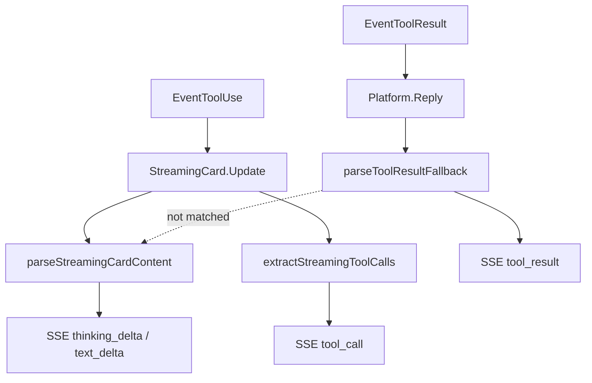

# chat-api Tool SSE Events Design

Date: 2026-07-15

## Goal

Expose tool use / tool result as first-class SSE events so frontends do not
treat Engine progress markdown as assistant answer text.

## Problem

With StreamingCard active:

- `EventToolUse` → `StreamingCard.Update` with `🔧 **Tool #N**` blocks.
  `parseStreamingCardContent` strips them from `text_delta`, but never emits
  a dedicated event.
- `EventToolResult` has **no** StreamingCard branch; Engine sends
  `formatToolResultEventFallback` (`🧾` / status / exit code) via `Reply`.
  That markdown was parsed as answer → `text_delta`, polluting the UI and
  causing duplicate text when answer snapshots were replaced.

## Decisions

| Decision | Choice |
|----------|--------|
| Event names | `tool_call`, `tool_result` |
| Carrier | Parse existing StreamingCard + Reply markdown (no new core interface) |
| History | Not persisted; same as `thinking_delta` |
| `tool_call_id` | String index from `Tool #N`; results match by emission order |
| `text_delta` | Answer-only; never contains `🔧` / `🧾` tool markdown |

## SSE contract

```text
event: tool_call
data: {"message_id":"...","tool_call_id":"1","name":"Bash","input":"date"}

event: tool_result
data: {"message_id":"...","tool_call_id":"1","name":"Bash","status":"ok","exit_code":0,"success":true,"output":"..."}
```

Omittable fields: `input`, `output`, `status`, `exit_code`, `success` when unknown.

Ordering within a turn:

```text
message → (thinking_delta | tool_call | tool_result | text_delta)* → message_end
```

## Data flow



## Non-goals

- No Engine `ToolEventNotifier` (revisit if multiple platforms need it).
- No `permission_request` SSE.
- Tool events are not replayed from history API.
