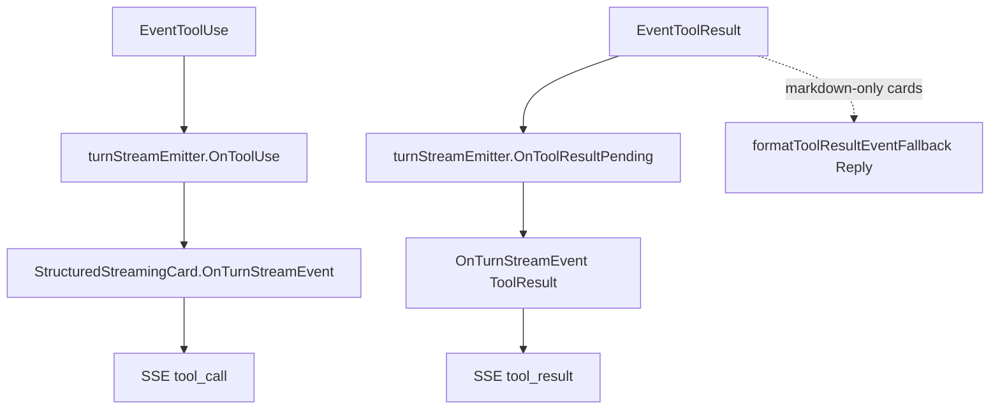

# chat-api Tool SSE Events Design

Date: 2026-07-15  
Updated: 2026-07-21 (Phase 3 — structured carrier)

## Goal

Expose tool use / tool result as first-class SSE events so frontends do not
treat Engine progress markdown as assistant answer text.

## Problem (historical)

With StreamingCard active (pre–structured stream):

- `EventToolUse` → `StreamingCard.Update` with `🔧 **Tool #N**` blocks.
  `parseStreamingCardContent` stripped them from `text_delta`, but never emitted
  a dedicated event.
- `EventToolResult` had **no** StreamingCard branch; Engine sent
  `formatToolResultEventFallback` (`🧾` / status / exit code) via `Reply`.
  That markdown was parsed as answer → `text_delta`, polluting the UI.

## Decisions

| Decision | Choice |
|----------|--------|
| Event names | `tool_call`, `tool_result` |
| Carrier (current) | Engine `TurnStreamEvent` via `StructuredStreamingCard` |
| Carrier (legacy) | Markdown parse / 🧾 Reply sniff — retired for chat-api hot path |
| History | Not persisted; same as `thinking_delta` |
| `tool_call_id` | String index from tool `Index` (1-based); results match by Index / order |
| `text_delta` | Answer-only; never contains `🔧` / `🧾` tool markdown |

See also: [structured-streaming-card-design.md](./2026-07-21-structured-streaming-card-design.md).

## SSE contract

```text
event: tool_call
data: {"message_id":"...","tool_call_id":"1","name":"Bash","input":"date"}

event: tool_result
data: {"message_id":"...","tool_call_id":"1","name":"Bash","status":"ok","exit_code":0,"success":true,"output":"..."}
```

Omittable fields: `input`, `output`, `status`, `exit_code`, `success` when unknown.

Ordering within a turn:

```text
message → (thinking_delta | tool_call | tool_result | text_delta)* → message_end
```

## Data flow (current)



When `StructuredStreamingCard` is present, Engine **does not** `sendRaw` the 🧾
fallback. chat-api `Reply` drops any residual 🧾 markdown so it cannot enter
`text_delta`.

## Non-goals

- Tool events are not replayed from history API.
- DingTalk / Slack keep markdown `Update` / optional standalone tool Reply.
