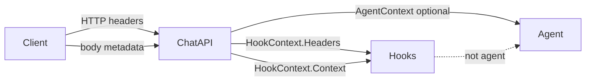

# chat-api `forward_headers` Design

> Version: 2026-07-21  
> Status: approved — implement in `platform/chat-api`  
> Public API: [chat-api.zh-CN.md](../chat-api.zh-CN.md)  
> Reference: a2a `forward_headers` ([a2a.md](../a2a.md), `platform/a2a/headers.go`)

## Goal

Allow chat-api to whitelist inbound HTTP headers and expose them to cc-connect hooks as `headers` / `CC_HOOK_HEADERS_JSON`, matching a2a semantics. Headers must **not** enter the coding agent prompt.

## Existing related options

| Option | Destination | Agent prompt? |
|--------|-------------|----------------|
| body `metadata` | `HookContext.Context` | No |
| `agent_context_headers` | `Message.AgentContext` | Yes (via `inject_context`) |
| **`forward_headers` (new)** | `HookContext.Headers` | No |

These are orthogonal: the same header name may appear in both `forward_headers` and `agent_context_headers`.

## Config

```toml
[projects.platforms.options]
forward_headers = ["X-Tenant-Id", "X-Trace-Id"]
```

Default: empty (no headers forwarded).

## Behavior

On `POST /chat-messages`:

1. Normalize configured names (`http.CanonicalHeaderKey`, dedupe, drop empties).
2. Always block: `Authorization`, `Cookie`, `Proxy-Authorization`, `Set-Cookie`, `WWW-Authenticate`, `Proxy-Authenticate` (same set as a2a).
3. Collect matching request header values; multi-value joined with `", "`.
4. Store on `replyContext.headers`.
5. `HookContext()` returns both `Headers` (forwarded) and `Context` (body metadata).
6. Append whitelist names to CORS `Access-Control-Allow-Headers` (same as `agent_context_headers`).

Cancel / interaction respond do not collect headers (hooks for those paths are not message.received/processing for a new user query).

## Data flow



## Testing

- Normalize: dedupe, block sensitive names
- Collect from `http.Request`
- End-to-end: `POST /chat-messages` → `HookContext.Headers` set; `ExtraContent` empty; AgentContext unchanged unless also mapped
- CORS includes forwarded header names

## Docs / config

- `docs/chat-api.zh-CN.md` — options table + hooks section
- `docs/chat-api.md` — brief mention
- `config.example.toml` — commented example next to chat-api options
- This design doc

---

# Implementation Plan

> **For Claude:** execute task-by-task; keep docs and code aligned.

**Goal:** chat-api supports a2a-compatible `forward_headers` for hooks + CORS.

**Architecture:** Local helpers in `platform/chat-api/headers.go` (mirror a2a, no shared package). Wire through Platform field → replyContext → HookContext; extend CORS.

**Tech Stack:** Go, `net/http`, existing `core.HookContextProvider`.

### Task 1: Headers helpers + unit tests

**Files:**
- Create: `platform/chat-api/headers.go`
- Create: `platform/chat-api/headers_test.go`

### Task 2: Wire Platform + chat + CORS

**Files:**
- Modify: `platform/chat-api/chatapi.go`, `chat.go`, `auth.go`
- Optionally: `debug_ui.go` expose `forward_headers` in config.json

### Task 3: Integration tests

**Files:**
- Modify: `platform/chat-api/headers_test.go` or `agent_context_test.go` patterns

### Task 4: Docs

**Files:**
- Modify: `docs/chat-api.zh-CN.md`, `docs/chat-api.md`, `config.example.toml`
- Update: `docs/plans/2026-06-29-chat-api-platform-design.md` Hooks row if needed

### Task 5: Verify

```bash
go test ./platform/chat-api/ -count=1
```
