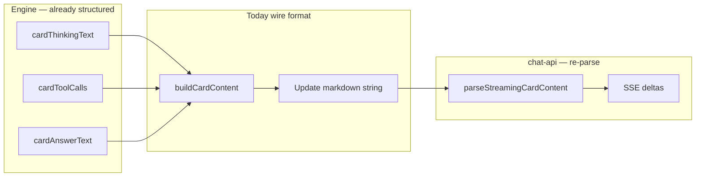
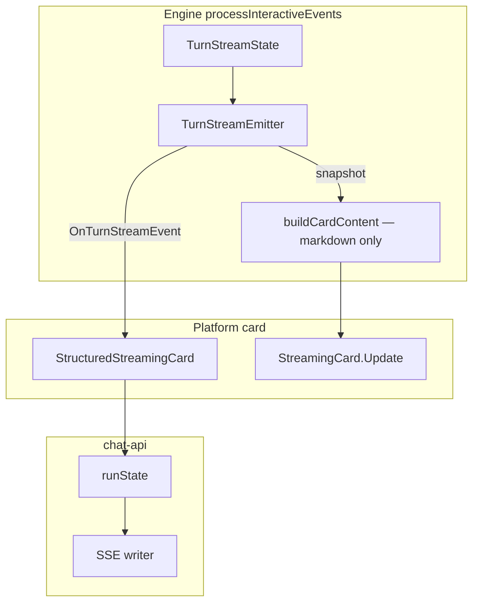

# Structured StreamingCard Design

Date: 2026-07-21

Status: **Phase 1–3 implemented** (follows v10.1.32 hotfix)

Related:

- [chat-api stream answer parse hotfix](./2026-07-21-chat-api-stream-answer-parse-design.md) (shipped v10.1.32)
- [chat-api Tool SSE](./2026-07-15-chat-api-tool-sse-design.md) (superseded carrier for tool events in Phase 3)
- [chat-api platform](./2026-06-29-chat-api-platform-design.md)

## Goal

Eliminate the encode-then-decode loop where Engine already holds structured turn
state (`thinking`, `tools`, `answer`) but exposes it only as Markdown via
`buildCardContent` → `StreamingCard.Update(string)`, forcing chat-api to
re-parse with fragile heuristics (`---` separators, tool markers, 🧾 fallback).

**Target:** Engine emits typed turn-stream events; chat-api maps them directly
to SSE. Markdown card rendering remains for DingTalk / Slack / A2A without
behavior change.

## Problem recap



Pain points (fixed in v10.1.32 at parse layer, root cause remains):

1. Answer body may contain `\n\n---\n\n` — same token as structural separator.
2. Append vs replace semantics inferred by comparing string snapshots client-side.
3. `EventToolResult` bypasses StreamingCard → `Reply` with 🧾 markdown → sniffed
   in chat-api (`parseToolResultFallback`).

## Decisions

| Decision | Choice | Rationale |
|----------|--------|-----------|
| New core types | `TurnStreamSnapshot`, `TurnStreamEvent` | Value types, no platform imports |
| Capability interface | `StructuredStreamingCard` (optional) | DingTalk/Slack keep `Update(string)` only |
| Markdown path | Retained via `buildCardContent` for non-structured cards | Zero impact on existing IM cards |
| Append vs replace | Engine decides on `EventText` | Single source of truth |
| Tool results | Structured `TurnStreamToolResult` event | Drop 🧾 Reply sniffing in Phase 3 |
| History storage | Unchanged — plain assistant answer text | Out of scope |
| SSE contract | Keep `text_delta` + optional `replace` | No breaking change for App clients |
| Migration | 3 PRs, dual-write in Phase 1 | Safe rollout |

## Architecture

### Target data flow



### Core types (`core/turn_stream.go`)

```go
// TurnToolCall is one tool invocation in display order (Index is 1-based).
type TurnToolCall struct {
    Index  int
    Name   string
    Input  string
    Result *TurnToolResult // nil until result arrives
}

type TurnToolResult struct {
    Output   string
    Status   string
    ExitCode *int
    Success  *bool
}

// TurnStreamSnapshot is a consistent full view at end-of-turn (or throttle point).
type TurnStreamSnapshot struct {
    Thinking string
    Answer   string
    Tools    []TurnToolCall
}

type TurnStreamEventKind int

const (
    TurnStreamThinkingReplace TurnStreamEventKind = iota
    TurnStreamAnswerAppend
    TurnStreamAnswerReplace
    TurnStreamToolUpsert
    TurnStreamToolResult
)

type TurnStreamEvent struct {
    Kind     TurnStreamEventKind
    Thinking string       // ThinkingReplace: full thinking text
    Answer   string       // Append: suffix; Replace: full answer
    Tool     TurnToolCall // Upsert / Result (Result fills Tool.Result)
}
```

### Optional interface (`core/interfaces.go`)

```go
// StructuredStreamingCard is optional. Implementations receive typed turn
// events instead of relying on Markdown parsing. Engine still calls
// StreamingCard.Update/Finalize for markdown-capable platforms; structured
// implementors may no-op Update when consuming events only.
type StructuredStreamingCard interface {
    StreamingCard
    OnTurnStreamEvent(ctx context.Context, ev TurnStreamEvent) error
}
```

**Note:** `OnTurnStreamSnapshot` is intentionally omitted from v1 — Finalize
passes final answer via existing `pendingResult` / history path; chat-api reads
internal `runState` at `Finalize`. Add snapshot hook later if A2A needs typed
artifact parts without markdown.

### TurnStreamEmitter (`core/turn_stream.go`)

Internal helper owned by one agent turn:

```go
type turnStreamEmitter struct {
    card     StreamingCard
    structed StructuredStreamingCard // nil if card doesn't implement
    thinking string
    tools    []TurnToolCall
    answer   strings.Builder
}

func (e *turnStreamEmitter) emitMarkdownUpdate(ctx context.Context) {
    if e.structed != nil {
        return // Phase 2+: structured-only chat-api skips markdown
    }
    tools := e.toolsAsCardEntries()
    _ = e.card.Update(ctx, buildCardContent(e.thinking, tools, e.answer.String()))
}

func (e *turnStreamEmitter) OnThinking(ctx context.Context, text string) {
    e.thinking = text
    if e.structed != nil {
        _ = e.structed.OnTurnStreamEvent(ctx, TurnStreamEvent{
            Kind: TurnStreamThinkingReplace, Thinking: text,
        })
    }
    e.emitMarkdownUpdate(ctx)
}

func (e *turnStreamEmitter) OnToolUse(ctx context.Context, index int, name, input string) {
    e.tools = append(e.tools, TurnToolCall{Index: index, Name: name, Input: input})
    if e.structed != nil {
        _ = e.structed.OnTurnStreamEvent(ctx, TurnStreamEvent{
            Kind: TurnStreamToolUpsert,
            Tool: e.tools[len(e.tools)-1],
        })
    }
    e.emitMarkdownUpdate(ctx)
}

func (e *turnStreamEmitter) OnToolResult(ctx context.Context, index int, res TurnToolResult) {
    // merge into e.tools by Index
    if e.structed != nil {
        _ = e.structed.OnTurnStreamEvent(ctx, TurnStreamEvent{
            Kind: TurnStreamToolResult,
            Tool: TurnToolCall{Index: index, Result: &res},
        })
    }
    // Phase 1: still send markdown Update; Phase 3: skip Reply fallback for structured
    e.emitMarkdownUpdate(ctx)
}

func (e *turnStreamEmitter) OnAnswerText(ctx context.Context, full string) {
    prev := e.answer.String()
    e.answer.Reset()
    e.answer.WriteString(full)
    if e.structed != nil {
        kind := TurnStreamAnswerAppend
        payload := full
        if !strings.HasPrefix(full, prev) {
            kind = TurnStreamAnswerReplace
            payload = full
        } else {
            payload = full[len(prev):]
            if payload == "" {
                return
            }
        }
        _ = e.structed.OnTurnStreamEvent(ctx, TurnStreamEvent{Kind: kind, Answer: payload})
    }
    e.emitMarkdownUpdate(ctx)
}
```

Engine replaces inline `buildCardContent` + `streamCard.Update` blocks with
calls to `turnStreamEmitter` methods (see mapping table below).

### Event mapping (Engine agent events → emitter)

| Agent event | Emitter method | Structured event | Markdown Update |
|-------------|----------------|------------------|-----------------|
| `EventThinking` | `OnThinking` | `ThinkingReplace` | yes (non-structured) |
| `EventToolUse` | `OnToolUse` | `ToolUpsert` | yes |
| `EventToolResult` | `OnToolResult` | `ToolResult` | yes (Phase 1–2); structured-only in Phase 3 |
| `EventText` (stream) | `OnAnswerText` | `Append` or `Replace` | yes |
| Turn end | `card.Finalize` | — | `buildCardContent` final |

### chat-api mapping (StructuredStreamingCard → SSE)

| TurnStreamEvent | SSE | Payload |
|-----------------|-----|---------|
| `ThinkingReplace` | `thinking_delta` | `{text}` or `{text, replace:true}` if non-prefix |
| `AnswerAppend` | `text_delta` | `{text: suffix}` |
| `AnswerReplace` | `text_delta` | `{text: full, replace:true}` |
| `ToolUpsert` | `tool_call` | existing shape |
| `ToolResult` | `tool_result` | existing shape |

Implementation replaces `applyCardContent` / `parseStreamingCardContent` with
direct `runState` updates inside `OnTurnStreamEvent`. `Update(string)` becomes
`return nil` (or debug log) once Phase 2 is verified.

## Platform impact

| Platform | Phase 1 | Phase 2 | Phase 3 |
|----------|---------|---------|---------|
| chat-api | Implement `StructuredStreamingCard` (dual path) | Switch primary path; deprecate parser | Remove parser + tool sniff |
| dingtalk | No change | No change | No change |
| slack | No change | No change | No change |
| a2a | No change | Implements `StructuredStreamingCard`; artifact = answer/thinking text | No 🧾 path |

## Phased rollout

### Phase 1 — Core types + dual-write (PR-1)

**Status:** Implemented (2026-07-21)

**Scope:** `core/turn_stream.go`, `core/interfaces.go`, `core/engine.go`, tests

**Work:**

1. Add types + `StructuredStreamingCard` interface.
2. Introduce `turnStreamEmitter`; wire into `processInteractiveEvents` where
   `streamCard != nil`.
3. Keep existing `buildCardContent` + `Update` for all cards (including
   chat-api) — structured events emitted **in addition** when implemented.
4. chat-api: production path still uses markdown until PR-2 (no consumer yet).

**Acceptance:**

- [x] `go test ./core/...`
- [x] `go test ./platform/chat-api/...` — behavior identical to v10.1.32
- [x] `TestTurnStreamEmitter_AnswerAppendAndReplace`
- [x] `TestTurnStreamEmitter_ToolUseAndResult`

### Phase 2 — chat-api primary path (PR-2)

**Status:** Implemented (2026-07-21)

**Scope:** `platform/chat-api/*`

**Work:**

1. `streamingCard.OnTurnStreamEvent` drives `runState` + SSE flush.
2. `streamingCard.Update` → no-op once structured events are active (legacy
   Update/Finalize markdown path kept for unit tests that do not emit events).
3. `Finalize`: use internal `runState` answer when structured; ignore markdown.
4. Skip 🧾 `parseToolResultFallback` enqueue when structured primary (avoids
   duplicate `tool_result` under Engine dual-write).

**Acceptance:**

- [x] Existing `scenario_stream_test.go` pass (legacy Update path)
- [x] `TestStructuredStreamNoMarkdownUpdate`
- [x] `TestStructuredStreamToolEventsSkipMarkdownSniff`
- [x] SSE contract unchanged (`text_delta` + optional `replace`)

### Phase 3 — ToolResult cleanup (PR-3)

**Status:** Implemented (2026-07-21)

**Scope:** `core/engine.go`, `platform/chat-api`, tool SSE design doc

**Work:**

1. When `StructuredStreamingCard` active, `EventToolResult` does **not** call
   `sendRaw(formatToolResultEventFallback)`.
2. chat-api `Reply` drops 🧾 markdown (never enqueue, never `text_delta`).
3. Updated [Tool SSE design](./2026-07-15-chat-api-tool-sse-design.md) carrier
   to Engine `TurnStreamEvent`.

**Acceptance:**

- [x] `TestToolCallAndResultSSENotInTextDelta` green (structured events)
- [x] `TestStructuredStreamToolEventsSkipMarkdownSniff` — single `tool_result`
- [x] No 🧾 in SSE bodies

## Testing strategy

| Layer | Tests |
|-------|-------|
| `core/turn_stream_test.go` | Append, replace, thinking, multi-tool, empty answer |
| `core/engine_test.go` | Extend `stubStructuredStreamingCard`; assert event order on synthetic agent stream |
| `platform/chat-api` | Keep scenario tests; add `TestStructuredStreamNoMarkdownUpdate` |
| CUJ (optional) | `TestCUJ_*` — user query → SSE full answer with `---` → GET messages match |

Regression: DingTalk/Slack tests unchanged — still receive markdown `Update`.

## Files to touch (summary)

| File | Action |
|------|--------|
| `core/turn_stream.go` | **New** — types + emitter |
| `core/turn_stream_test.go` | **New** |
| `core/interfaces.go` | Add `StructuredStreamingCard` |
| `core/engine.go` | Replace inline card updates with emitter |
| `platform/chat-api/chat.go` | Implement structured card |
| `platform/chat-api/run.go` | Event handlers; remove parser calls (Phase 2) |
| `platform/chat-api/card_stream.go` | **Delete** after Phase 3 (or keep tool parse for migration flag only) |
| `docs/plans/2026-07-15-chat-api-tool-sse-design.md` | Update data-flow diagram (Phase 3) |

## Non-goals

- Changing `buildCardContent` separator tokens for DingTalk/Slack.
- Persisting thinking/tools in history API.
- New SSE event names (`answer_append`) — reuse `text_delta` + `replace`.
- Multi-platform structured UI (Feishu cards, etc.) in v1.

## Risks

| Risk | Mitigation |
|------|------------|
| Dual-write drift (markdown vs events) | Phase 1 test asserts snapshot consistency; chat-api compares both paths in PR-2 before deleting parser |
| Engine patch complexity | Emitter isolates logic; minimal edits at each `streamCard.Update` call site |
| Tool result ordering | Reuse 1-based Index + emission order (same as current `tool_call_id`) |
| Finalize empty content | chat-api uses `runState.answerText`; document in interface comment |

## PR checklist (each phase)

- [ ] `go test ./...`
- [ ] No new platform/agent name hardcoding in `core/` (capability checks only)
- [ ] Design doc section updated if decisions change
- [ ] `docs/chat-api.zh-CN.md` version history if SSE semantics change (Phase 2: none expected)
- [ ] Bug fix regression test if fixing observable behavior

## Implementation order (next session)

1. Land PR-1 (`core/turn_stream.go` + engine wiring + unit tests).
2. Land PR-2 (chat-api structured card + delete parser from hot path).
3. Land PR-3 (tool result Reply bypass + doc update).

After Phase 3, optional follow-up: A2A artifact streaming from `TurnStreamEvent`
without markdown intermediate.
