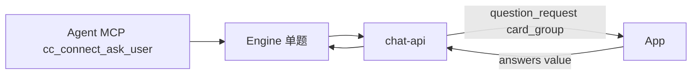

# AskUserQuestion 单确认 + 卡片契约（card_group）

> Date: 2026-07-22  
> Status: implemented  
> Updated: 2026-07-23 — Claude Code 主路径改为常驻 MCP `cc_connect_ask_user`（见 [2026-07-23-cc-connect-ask-user-mcp-design.md](./2026-07-23-cc-connect-ask-user-mcp-design.md)）；SSE `question_request` / `respond` 不变；原生 AskUserQuestion 仅作 `ask_user_mode=native|hybrid` 降级

## Goal

1. **默认单确认**：Engine/Claude 单题；SSE `card_group` 长度恒为 1（数组仅为契约形状）。
2. **卡片契约**：信封 + `card_group`；`event` / `tag` / `others.custom_input`；回传 `answers[]`。
3. **MCP 来源**：Claude Code 默认通过 MCP 工具保留结构化提问字段，SSE 契约保持稳定。

## Non-goals

- Engine BatchMode / Claude 多题一次弹卡
- 业务流程引导（`client_flow`）不属于本 MCP + SSE 卡片契约切片；其独立 MCP 与非阻塞 SSE 见 [`client_flow` 设计](./2026-07-23-chat-api-client-flow-design.md)
- 用契约 `{code:0}` 替换 chat-api `{ok,data}` 信封

## Agent 侧来源（Claude Code）

**主路径（默认 `ask_user_mode=mcp`）**：模型调用 MCP 工具 `mcp__ccconnect__cc_connect_ask_user`，字段一等透传至 `core.UserQuestion`，再由 chat-api 渲染 `question_request`。完成后 Engine 经 `AskUserHub.Complete` 回传 **tool result**（不走 Claude `control_response`）。

**降级**：`native` / `hybrid` 仍可走 Claude 原生 `AskUserQuestion`；此时 `can_use_tool` 可能剥掉扩展字段（`event` / `value` / `tag` / `allow_custom_input`）。仅当 tool 输入显式带 `allow_custom_input` 时才会打开自定义输入。

## Core 最小模型

与 chat-api SSE **协议形状不变**；core 只保留透传所需字段，legacy 在解析层折叠：

| tool 输入 | core | SSE |
|-----------|------|-----|
| `question` / `title` / `header` | `Question`（first non-empty） | `Card.title` |
| `recommended: true` | `Option.Tag = "推荐"`, `TagVariant = "recommend"` | `Option.tag` |
| `allow_custom_input: true` | `AllowCustomInput = true` | `others.custom_input.enabled: true` |
| `allow_custom_input: false` 或未传 | `AllowCustomInput = false` | 省略 `others.custom_input` |
| `tag: {text, variant}` 或 string | `Option.Tag`, `Option.TagVariant`（object 时） | `Option.tag`；显式 variant 优先，否则按 text 推断 |
| `value: 5000`（number） | `Value: "5000"` | `Option.value`（number） |

MCP 工具示例（推荐）：

```json
{
  "question": "Which bank account should be used?",
  "event": "connect_account",
  "options": [
    {
      "label": "Bank of China",
      "description": "Use the Bank of China account",
      "value": "boc",
      "tag": {"text": "Recommended", "variant": "recommend"}
    },
    {
      "label": "ICBC",
      "description": "Use the ICBC account",
      "value": "icbc"
    }
  ],
  "allow_custom_input": true,
  "multi_select": false
}
```

原生 AskUserQuestion 降级示例仍可用 `questions[]` + `header`（Claude 必填），但扩展字段可能被 CLI 过滤。

```go
type UserQuestion struct {
    Question, Description, Event string
    AllowCustomInput bool
    MultiSelect bool
    Options []UserQuestionOption
}

type UserQuestionOption struct {
    Label, Description, Value, Tag, TagVariant string
}
```

**不在 core 保留**：`ID` / `Title` / `Header` / `Placeholder` / `SubmitLabel` / `Variant` / `Recommended` / `Display` / `Others`。

## chat-api `question_request`

```json
{
  "interaction_id": "ix_...",
  "run_id": "run_...",
  "message_id": "...",
  "expires_at": 1784684077,
  "event": "connect_account",
  "card_group": [{
    "type": "single_select",
    "title": "...",
    "description": "...",
    "others": { "custom_input": { "enabled": true } },
    "options": [
      { "label": "...", "value": "acc_sg", "tag": { "text": "推荐", "variant": "recommend" } }
    ]
  }]
}
```

无顶层 `prompt` / `actions` / `allow_custom_input` / `multi_select`。

## Respond

唯一路径：`POST /v1/conversations/messages/respond`

- 问答：`{ conversation_id?, run_id, interaction_id, answers:[{index,value|custom_input}] }`  
  chat-api 将 `value` 反查为内部 `askq:` 再交给 Engine。
- 权限：`{ run_id, interaction_id, decision }`（`allow` / `deny` / `allow_all`）。

不再提供 `POST /runs/.../interactions/.../respond`。

## Architecture



SSE 边界不变；Agent 侧来源见 [cc-connect Ask User MCP](./2026-07-23-cc-connect-ask-user-mcp-design.md)。

## Debug UI

`/debug/` 中的单选和多选控件使用内容宽度，不继承文本输入框的
`width: 100%` 与 padding；选项文字占据其余空间，避免被 radio/checkbox
挤压。

当 `others.custom_input.enabled` 时，「其他…自己输入」也是选项列表中的一项
radio/checkbox；选中后在旁输入，Commit 时以 `answers[].custom_input` 回传
（内容即用户输入的 value）。
