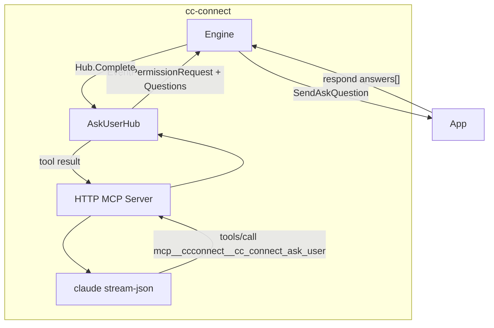

# cc-connect Ask User MCP（Claude Code 首期）

> Date: 2026-07-23  
> Status: implemented  
> SSE contract: unchanged (`question_request` / `respond`)

## Goal

1. 结构化提问不再依赖 Claude Code 原生 `AskUserQuestion` schema（其 `can_use_tool` 会过滤扩展字段）。
2. 常驻 HTTP MCP 暴露 `cc_connect_ask_user`，一等字段：`event` / `value` / `tag` / `allow_custom_input`。
3. Engine 以 `len(Questions) > 0` 判定提问流；chat-api SSE 契约不变。

## Non-goals

- 本阶段不迁移 Codex / Pi / Reasonix
- 不改 App `question_request` / `respond` 形状
- 不做 tool_use 缓存合并 permission input

## Architecture



## MCP tool schema

Server name: `ccconnect`  
Tool name: `cc_connect_ask_user`  
Claude sees: `mcp__ccconnect__cc_connect_ask_user`

```json
{
  "question": "string (required)",
  "description": "string",
  "event": "connect_account | create_task | task_center_approval | \"\" (optional)",
  "allow_custom_input": true,
  "multi_select": false,
  "options": [
    {
      "label": "string (required)",
      "description": "string",
      "value": "string|number",
      "tag": {
        "text": "string",
        "variant": "recommend(绿推荐) | keep(灰维持) | default(灰默认) | warning(黄警告)"
      }
    }
  ]
}
```

Single question per call (matches Engine single-confirm). Multi-question remains sequential Engine flow if needed later.

`event` 枚举仅三值；缺省 / `""` / `null` / 未匹配时归一为空：SSE 不带 `event` 字段，App 不渲染额外导航按钮，走通用发送/确认。

`tag.variant` 枚举：`recommend` 推荐（绿）、`keep` 维持（灰）、`default` 默认（灰）、`warning` 警告（黄）；未匹配则清空 variant。

## Session routing

- Daemon listens MCP on `127.0.0.1:<ephemeral>` (or `data_dir` unix-friendly TCP).
- Per Claude spawn, write mcp config:

```json
{
  "mcpServers": {
    "ccconnect": {
      "type": "http",
      "url": "http://127.0.0.1:PORT/mcp",
      "headers": {
        "X-CC-Session-Key": "<session_key>"
      },
      "timeout": 3600000
    }
  }
}
```

- `tools/call` reads `X-CC-Session-Key`, looks up `AskUserHub` binding.

## Blocking protocol

1. MCP `tools/call` → parse → `Hub.Ask(sessionKey, question)`
2. Hub emits `Event{Type:PermissionRequest, ToolName:cc_connect_ask_user, Questions, RequestID}` on the bound session event channel
3. Engine renders via existing `AskQuestionSender` / cards
4. User responds → `finalizeAskQuestion`
5. If `ToolName == cc_connect_ask_user` → `Hub.Complete(requestID, answers)`（**不**写 Claude `control_response`）
6. MCP returns tool result text summarizing answers; Claude continues turn

Long waits: MCP client `timeout` is 1h; `tools/call` blocks on the HTTP request. Mid-call MCP progress notifications are deferred (stateless Streamable HTTP POST has no open SSE channel during the call).

## Claude spawn flags (ask_user_mode=mcp)

- `--mcp-config <file>`
- `--disallowedTools AskUserQuestion`（合并用户配置）
- ensure `mcp__ccconnect__cc_connect_ask_user` is allowed when `allowedTools` is non-empty
- auto-allow `cc_connect_ask_user` / `mcp__ccconnect__cc_connect_ask_user` on any residual `can_use_tool`

## ask_user_mode

| mode | behavior |
|------|----------|
| `mcp` (default) | MCP path; disallow native AskUserQuestion |
| `native` | legacy AskUserQuestion permission path |
| `hybrid` | prefer MCP; if Hub/MCP unavailable at spawn, fall back to native |

## Engine changes

- `isStructuredAsk(event) := len(event.Questions) > 0`
- Canonical: `core.ToolCCConnectAskUser = "cc_connect_ask_user"`
- Compatibility: still accept `AskUserQuestion` / `extension_select` when Questions set
- `AgentSystemPrompt` documents MCP tool + example JSON（无 Claude-only `header` 依赖）

## Invariants

- chat-api `question_request` / `respond` unchanged
- core `UserQuestion` unchanged as SSE source model
- Permission tools（Bash 等）仍走 `control_response`
