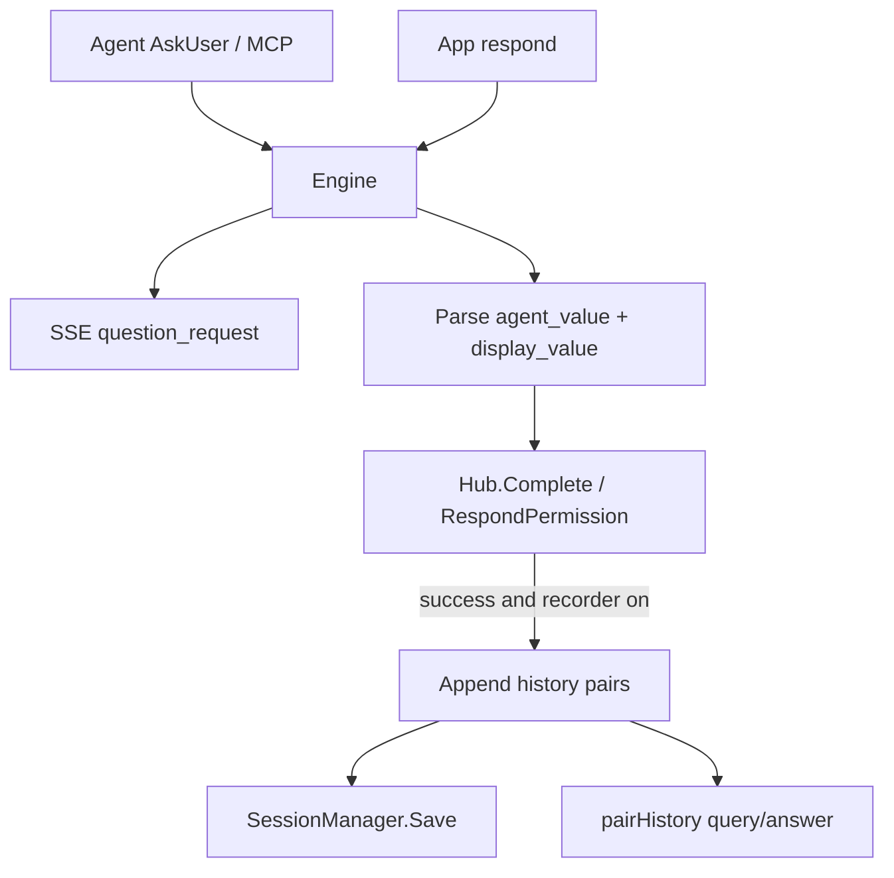

# chat-api AskUserQuestion 写入历史对话

> Date: 2026-07-23  
> Status: approved  
> Updated: 2026-07-23 — chat-api **始终写入**（无配置开关）

## Goal

在 **chat-api** 场景下，将结构化确认（`AskUserQuestion` / `cc_connect_ask_user`）的问题与用户确认结果写入 Session 历史，使 `GET /conversations/{id}/messages` 能以普通对话轮次回放该交互。

## Non-goals

- 不提供配置开关（chat-api 恒开启）
- 不扩展历史 API schema（不新增 `ask_user_questions` 字段）
- 不把 permission 确认窗口写入历史
- 不在 core 硬编码 `"chat-api"` 平台名
- 不改变提交给 Agent 的 `answers`（仍优先使用 option `value`）

## Architecture



### Capability interface（core）

```go
// AskUserQuestionHistoryRecorder is implemented by platforms that want
// AskUserQuestion Q&A persisted as normal session history turns.
type AskUserQuestionHistoryRecorder interface {
	RecordAskUserQuestionHistory() bool
}
```

chat-api 恒返回 `true`。Engine 通过类型断言启用，不判断平台名称。其他平台不实现 → 永不落 AskUserQuestion 历史。

### History shape（synthetic turns）

一次用户请求若触发结构化确认，历史顺序为：

1. `user` = 原始用户 query（已有）
2. 对每个问题（多题按回答顺序）：
   - `assistant` = 可读问题文本（标题 / 问题 / 描述 / 选项 label）
   - `user` = 用户看到的 label，或自定义输入原文
3. `assistant` = Agent 最终回复（已有）

`pairHistory` 无需改 schema，自然配对为：

| query | answer |
|-------|--------|
| 原始请求 | AskUserQuestion 问题1 |
| 用户选择1 | AskUserQuestion 问题2（或多题时下一问） |
| … | … |
| 最后一题选择 | Agent 最终回复 |

单题时即为：`原始请求 → 问题`、`用户选择 → 最终回复`。

### Dual-value answer parsing

| 用途 | 来源 |
|------|------|
| 提交 Agent（`agent_value`） | option `value`，空则回退 `label`；自定义输入用原文 |
| 写入历史（`display_value`） | option `label`；自定义输入用原文 |

现有 `resolveAskQuestionAnswer` / `resolveAskQuestionDisplayAnswer` 已产出双值；落历史仅用 `DisplayAnswers`。

### Write timing

1. SSE 发出问题时 **不**写历史。
2. 多题期间暂存 `(question, display_value)`（已有 `Answers` / `DisplayAnswers`）。
3. **全部题目答完且回传成功**（MCP `Hub.Complete` 成功 / 原生 `RespondPermission` 无错）后，按顺序一次性 `AddHistory`：
   - assistant(question text) → user(display_value) × N
4. 然后解除 pending，让 Agent 继续产出最终回复（最终 assistant 自然排在后面）。
5. 每次写入后 `sessions.Save()`。

### Failure / skip rules

整组确认 **不写历史** 当：

- 平台未实现 `AskUserQuestionHistoryRecorder` 或返回 `false`
- 任一题未完成（超时 / 取消 / 用户放弃）
- `RespondPermission` 失败 / MCP `Complete` 未命中 waiter

禁止写入半组残缺配对。

### Question text format（assistant history）

可读纯文本，例如：

```text
选择账户

请选择要操作的账户

已开户账户列表

1. ★ 推荐 · 工资卡 (尾号 1234)
2. 理财卡 (尾号 5678)
```

字段优先级：`Header` → `Question`（与 Header 相同时不重复）→ `Description` → 编号选项（用 `formatAskOptionLabel`；推荐项可带 ★）。不写入 option `value`。

## Compatibility

- 历史 API 仍返回 `query`/`answer`/`user_id`/`user_name`/`created_at`。
- IM 平台不实现该接口 → 行为不变。
- permission 确认仍不落历史。

## Docs

- `docs/chat-api.md` / `docs/chat-api.zh-CN.md`：说明确认卡片会作为普通轮次出现在历史中

## Testing

- 默认平台：AskUserQuestion 不增加历史条目
- chat-api（recorder=true）：单题写入 2 条（assistant 问题 + user label）再接最终回复
- 多题：按序写入多组配对
- label/value 分离：历史用 label，Agent 收到 value
- 自定义输入：历史与 Agent 均为原文
- `RespondPermission` 失败 / 超时：不落库
