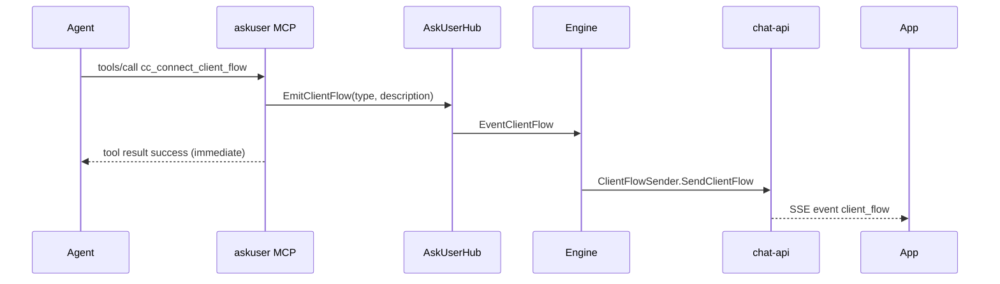

# chat-api `client_flow` SSE（独立 MCP）

> Date: 2026-07-23  
> Status: implemented
> Related: [Ask User MCP](./2026-07-23-cc-connect-ask-user-mcp-design.md)、[AskUserQuestion 卡片契约](./2026-07-22-askuserquestion-rich-confirm-design.md)  
> External contract: `logs/agent-chat-api.zh-CN.md` §3.6 `client_flow`

## Goal

1. 支持对外契约中的极简 SSE `client_flow`：`type` + `description`（另加 `flow_id` / `run_id` / `message_id`），以及可选 `args` 透传流程参数。
2. 通过**独立 MCP 工具**由 Agent 显式触发，与 `question_request` / `cc_connect_ask_user` 解耦。
3. 不阻塞 interaction 槽；不要求 App `respond`。

## Non-goals

- 不修改 `cc_connect_ask_user` / `question_request.event` 语义
- 不传 URL / deep_link
- 可选 `args` 字符串透传流程参数；语义由 `type` 决定（task 类 → task_id，`connect_account` → provider）
- 不把 `client_flow` 写入 history
- 不为非 chat-api 平台做 UI 降级（静默成功）

## Decision summary

| 项 | 决定 |
|----|------|
| 触发方式 | 独立 MCP：`cc_connect_client_flow` |
| `type` 枚举 | 复用 `connect_account` / `create_task` / `task_center_approval` |
| 文档修正 | 对外示例 `account_bind` → `connect_account` |
| 非 chat-api | 已绑定 session 仍正常发出事件；Engine 发现平台未实现 `ClientFlowSender` 后跳过 |
| 与确认卡关系 | 可并存；各自独立 SSE |

## Architecture



### Core

- 新增 `EventClientFlow EventType = "client_flow"`。
- `Event` 复用字段：`ToolName`、`ToolInput`（description）、`ToolInputRaw`（含 `type`/`description`）、可选 `RequestID`（仅日志追踪，非 interaction）。
- 可选平台能力：

```go
type ClientFlowSender interface {
	SendClientFlow(ctx context.Context, replyCtx any, flowType, description, args string) error
}
```

- `AskUserHub.EmitClientFlow` 校验后构造 `EventClientFlow`，复用 session 已实现的 `AskUserEmitter.EmitAskUser` 发入同一事件流；实现中**不存在**独立 `ClientFlowEmitter`：

```go
type AskUserEmitter interface {
	EmitAskUser(event Event) error
}
```

Claude session 在 Hub `Bind` 时注册现有 `AskUserEmitter`。如果 session 未绑定 emitter，MCP 调用返回错误；这与「session 已绑定、但当前平台不支持 `ClientFlowSender`」的 Engine no-op 是两种不同情况。

### MCP

同一 HTTP MCP server（`mcp/askuser`）新增工具：

- Name: `cc_connect_client_flow`
- Claude sees: `mcp__ccconnect__cc_connect_client_flow`

```json
{
  "type": "connect_account | create_task | task_center_approval",
  "description": "string (required)",
  "args": "string (optional; task types → task_id, connect_account → provider)"
}
```

校验：

- `type` 必须为三枚举之一（未知 → 参数错误，不清空后静默）
- `description` 必填非空
- 缺少 `X-CC-Session-Key` → 错误

成功：立即返回 text tool result（如 `client_flow emitted: connect_account`），**不**等待用户。

### Engine

在 `processInteractiveEvents`（或等价事件循环）处理 `EventClientFlow`：

1. 取当前平台；若实现 `ClientFlowSender`，调用 `SendClientFlow`。
2. 当前 session 已绑定 emitter、但平台未实现 `ClientFlowSender` → 打 debug 日志后忽略；不影响已经返回的 MCP 成功结果。
3. **不**创建 `pendingPermission`，不占 interaction 槽。

### chat-api

`SendClientFlow`：

```text
event: client_flow
data: {
  "flow_id":"flow_xxx",
  "type":"connect_account",
  "description":"绑定新账户",
  "args":"feishu",
  "run_id":"run_abc",
  "message_id":"s1a2b3c:1"
}
```

- 复用已有 `newFlowID()`。
- 仅 `enqueueEvent`，不 `replaceInteraction`，不启 timer。
- 可与同 run 上的 `question_request` 并存。

### Docs

- `docs/chat-api.zh-CN.md` / `docs/chat-api.md`：补充 `client_flow` 小节，与对外契约对齐。
- `logs/agent-chat-api.zh-CN.md`：将示例 `account_bind` 改为 `connect_account`；注明 type 枚举与 AskUser `event` 同源。
- `CHANGELOG.md`：记录新能力。

## Error / edge cases

| 场景 | 行为 |
|------|------|
| 未知 type / 空 description | MCP 参数错误（`isError` 或 RPC error） |
| session 无 emitter | MCP 错误（与 ask 一致） |
| 平台非 chat-api（session emitter 已绑定） | Emit 进 Engine；平台无 `ClientFlowSender` 时 no-op，MCP 仍成功 |
| run 已结束 / replyCtx 无效 | `SendClientFlow` 返回 error；Engine 打日志；MCP 侧若已返回成功则无法回滚（可接受；emit 应在工具返回前完成入队） |

> 为降低「SSE 未真正发出但 tool 已成功」的窗口：Hub 同步 `EmitClientFlow` 入 session events channel；Engine 尽快 flush。不引入 App 级 ACK。

## Testing

- MCP：`tools/list` 含新工具；合法 call 立即成功；非法 type/空 description 失败。
- Core：`Normalize` / 枚举复用测试。
- chat-api：`SendClientFlow` 产出 `client_flow` SSE 且不产生 interaction；与 `question_request` 并存时 interaction 槽仍仅属后者。
- Engine：无 `ClientFlowSender` 时不 panic、不阻塞 turn。

## Out of scope follow-ups

- 配置驱动扩展 type 枚举（当前硬编码三值，与 AskUser event 同步增减）
- history / analytics 落库
- 非 Claude agent 的 client_flow MCP 接入
