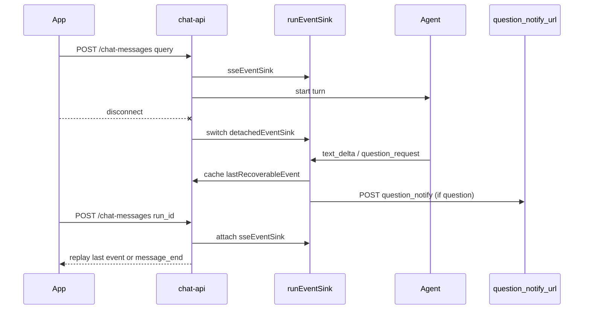

# chat-api 断链重连（SSE resume）

> Date: 2026-07-24
> Status: implemented
> Related: [chat-api platform design](./2026-06-29-chat-api-platform-design.md)、[interaction hardening](./2026-07-14-chat-api-interaction-hardening.md)
> External contract: [docs/chat-api.zh-CN.md](../chat-api.zh-CN.md)

## Goal

1. 客户端 SSE 断链后可用同一端点 `POST /chat-messages` 带 `run_id` 重连。
2. 断链期间只缓存**最后一条**可恢复事件（普通 `text_delta`/`thinking_delta` 或 `question_request`），重连后补发。
3. 断链后若产生 `question_request`，异步通知配置的外部 webhook。
4. 断链期间 turn 仍在跑时可 resume；若 turn 已在断线期间结束（run 已删除）或 run 不存在/非归属 user，resume → 空的 `message_end`（客户端可改查 history）。重连已挂上后 turn 结束仍正常发 `message_end`。

## Non-goals

- 完整事件日志 / `Last-Event-ID` 增量续传
- 跨进程 `pendingStore` 共享
- 断链自动 cancel Agent（语义保持不变：disconnect ≠ cancel）
- 首版对 `permission_request` 做独立 webhook（可与 question 走同一 sink 缓存，通知仅 question）

## Decision summary

| 项 | 决定 |
|----|------|
| 重连入口 | 复用 `POST /chat-messages`，body 含 `run_id`（无 `query`） |
| 缓存模型 | `lastRecoverableEvent`：断线后覆盖写入，只保留最后一条 |
| 连接抽象 | `runEventSink`：`sseEventSink` / `detachedEventSink` |
| 外部通知 | `question_notify_url`；仅断线后 `question_request` |
| 终态处理 | live / detached 一律 `complete()` + 立刻 `delete`；已挂上的 resume SSE 仍可通过 `done` 收到 `message_end` |
| 未匹配 resume | run 不存在 / 非归属 user → 空的 `message_end` |
| 缓存消费 | resume 先 `peek`，SSE 写成功后再 `clear`；写失败则 `detach` 并保留缓存 |
| 未决确认 | 断线后 `question_request`/`permission_request` 不被后续 `text_delta`/`thinking_delta` 覆盖 |
| 并发 | 同一 run 同时只允许一个活跃 SSE；已 attached 时 resume → `409` |

## Architecture



### runEventSink

```go
type runEventSink interface {
	Event(name string, payload any) error
	Active() bool
}
```

- `sseEventSink`：写真实 HTTP SSE。
- `detachedEventSink`：不写网络；覆盖 `lastRecoverableEvent`；`question_request` 触发 webhook。

`run.detach()` 切换到虚拟 sink；`run.attach(sse)` 切回真实 sink 并补发缓存。

### Resume request

```json
{ "run_id": "run_abc" }
```

校验 `run.user`；不要求 `query`；不创建 conversation；不调用 Engine handler。

### Webhook body

```json
{
  "event": "question_request",
  "run_id": "run_abc",
  "conversation_id": "conv_xxx",
  "message_id": "conv_xxx:1",
  "user_id": "user_001",
  "channel": "default_channel",
  "resume": {
    "method": "POST",
    "path": "/v1/chat-messages",
    "body": { "run_id": "run_abc" }
  },
  "payload": { }
}
```

Header：可选 `X-Chat-API-Notify-Secret`。

### Config

```toml
question_notify_url = ""
question_notify_secret = ""
question_notify_timeout = "5s"
```

## Testing

- 断线后 text → resume 补发 `replace:true` text_delta
- 断线后 question → webhook + resume 补发 question_request
- 多事件覆盖，只补最后一条
- 断线后 finish → 再 resume → 空的 `message_end`（查 history）
- attached 重复 resume → 409
- webhook 失败不阻塞 turn
- resume 已挂上后 finish → message_end
