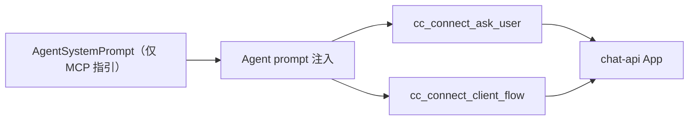

# 精简 Agent System Prompt 设计

> Date: 2026-07-24  
> Status: approved

## Goal

cc-connect 内置的 Agent system prompt 只保留 chat-api 结构化交互所需的两个 MCP 工具说明：

- `mcp__ccconnect__cc_connect_ask_user`
- `mcp__ccconnect__cc_connect_client_flow`

## Scope

从 `AgentSystemPrompt()` 删除以下能力说明：

- `cc-connect send`
- `cc-connect cron`
- `cc-connect timer`
- `cc-connect relay`
- `NO_REPLY`
- cc-connect 运行环境和普通文本投递说明

保留两个 MCP 工具的字段约束、使用时机和示例。Claude Code 仍通过
`--append-system-prompt-file` 注入这段最小提示；其他 Agent 的记忆文件回退机制不变。
平台提供的格式提示和用户配置的 `append_system_prompt` 继续按原逻辑拼接。

## Data flow

## Compatibility

CLI 和聊天侧的 send、cron、timer、relay 功能代码不删除；Agent 仅不再被内置 prompt
引导主动调用这些命令。现有自定义 prompt 可继续自行提供相关指引。

## Testing

- 断言 `AgentSystemPrompt()` 保留两个 MCP 工具及关键字段。
- 断言 prompt 不再包含 send、cron、timer、relay、`NO_REPLY` 等内置指引。
- 删除只验证已移除内容的旧测试，保留并收紧 MCP 行为测试。
