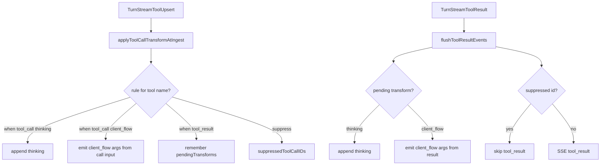

# chat-api Tool SSE Transform Design

Date: 2026-07-28  
Status: implemented  
Updated: 2026-08-08 — `when` selects tool_call vs tool_result; `args_from` fills `client_flow.args`

## Goal

Allow chat-api to convert selected tool SSE events into user-facing
`thinking_delta` or `client_flow` messages based on an **external JSON file**,
with per-rule multi-language text. Matched tools may suppress raw
`tool_call` / `tool_result` SSE.

Transform timing is controlled by `when` (`tool_call` | `tool_result`).
For `emit=client_flow`, optional `args_from` extracts a scalar into
`client_flow.args` from the active phase JSON (tool call input or tool result
output).

Scope is **chat-api only**; core/engine and other platforms are unchanged.

## Config surface

In `config.toml` chat-api platform options, only one path is required:

```toml
[projects.platforms.options]
tool_sse_transforms_file = "/path/to/tool-sse-transforms.json"
```

When omitted or empty, no transforms are applied (current behavior).

## External file schema

See `config/chat-api-tool-sse-transforms.example.json`.

```json
{
  "default": {
    "emit": "thinking",
    "suppress": true,
    "text": {
      "en": "Running {tool}...",
      "zh": "正在执行 {tool}..."
    }
  },
  "transforms": [
    {
      "tool": "Agent",
      "emit": "client_flow",
      "flow_type": "agent_call",
      "args_from": "$.message_id",
      "suppress": true,
      "text": {
        "en": "SubAgent running...",
        "zh": "子 Agent 执行中..."
      }
    },
    {
      "tool": "CreateTask",
      "emit": "client_flow",
      "when": "tool_result",
      "flow_type": "task_generating",
      "args_from": "$.task_id",
      "suppress": true,
      "text": {
        "en": "Generating task...",
        "zh": "正在生成任务..."
      }
    }
  ]
}
```

| Field | Required | Description |
|-------|----------|-------------|
| `default` | no | Fallback when no `transforms[]` entry matches; supports `{tool}` in `text` |
| `tool` | per transform | Tool name match (case-insensitive) |
| `emit` | yes | `thinking` or `client_flow` |
| `when` | no | `tool_call` (default) or `tool_result` — when to emit the transform |
| `suppress` | no | When true, skip `tool_call` / paired `tool_result` (default false) |
| `flow_type` | when `emit=client_flow` | Non-empty flow type string (e.g. `task_generating`, `create_task`) |
| `args_from` | no | Only for `emit=client_flow`. Object-field JSON path. Source is tool **call input** when `when=tool_call`, tool **result output** when `when=tool_result` |
| `args_from_result` | no | Alias of `args_from` (same semantics; does **not** imply `when=tool_result`) |
| `text` | yes | Map of locale → message (`en`, `zh`, `zh-TW`, `ja`, `es`, …) |

### Timing

- **Default**: omit `when` → always `tool_call`.
- `when=tool_call`: emit at structured `TurnStreamToolUpsert`. For
  `client_flow`, `args_from` reads tool call `input` JSON.
- `when=tool_result`: defer until paired `tool_result`. For `client_flow`,
  `args_from` reads result `output` JSON. One transformed event per tool call.

### `args_from` extraction

1. Parse the phase JSON (call input or result output) as an object.
2. Walk object keys from the path (`$` prefix optional; segments split by `.`).
3. Accept scalar leaf values: string, number, bool → stringify into `args`.
4. On missing path, invalid JSON, or object/array leaf: still emit `client_flow`
   with description/`flow_type`, but **omit** `args` (do not fail the turn).

`args_from` on `emit=thinking` or empty path after trim → config load error.

## Language selection

1. Request `AgentContext.language` (from `agent_context_headers`, e.g. `X-Language`)
2. Fallback: `en`
3. Within rule `text`: exact tag → `en` → first non-empty value

## Data flow



## Non-goals

- Input regex matching
- Full JSONPath (filters, wildcards, array indexes)
- Args templates / multi-field templates
- `when=both` (two events for one tool call)
- History persistence of transformed events
- Core or non-chat-api platform support
- Hot reload of transform file (restart required)

## Testing

- Load/validate external JSON (`when`, `args_from`, alias)
- Default `when=tool_call`
- thinking + suppress integration SSE test
- client_flow at tool_call with `args_from` from call input
- client_flow at tool_result with `args_from` from result
- thinking deferred to tool_result
- extract path helpers (nested fields, missing path, non-scalar)
- language fallback
- unmatched tool passthrough
