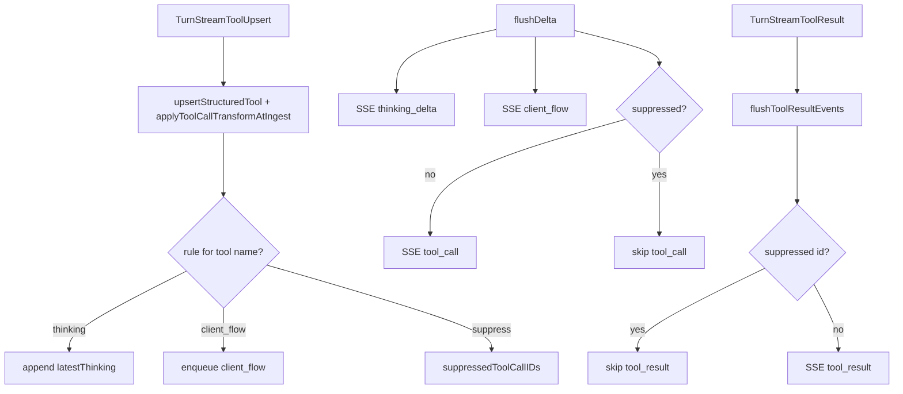

# chat-api Tool SSE Transform Design

Date: 2026-07-28  
Status: implemented

## Goal

Allow chat-api to convert selected `tool_call` SSE events into user-facing
`thinking_delta` or `client_flow` messages based on an **external JSON file**,
with per-rule multi-language text. Matched tools may suppress raw
`tool_call` / `tool_result` SSE.

Scope is **chat-api only**; core/engine and other platforms are unchanged.

## Config surface

In `config.toml` chat-api platform options, only one path is required:

```toml
[projects.platforms.options]
tool_sse_transforms_file = "/path/to/tool-sse-transforms.json"
```

When omitted or empty, no transforms are applied (current behavior).

## External file schema

See `config/chat-api-tool-sse-transforms.example.json`.

```json
{
  "default": {
    "emit": "thinking",
    "suppress": true,
    "text": {
      "en": "Running {tool}...",
      "zh": "正在执行 {tool}..."
    }
  },
  "transforms": [
    {
      "tool": "Bash",
      "emit": "thinking",
      "suppress": true,
      "text": {
        "en": "Running command...",
        "zh": "正在执行命令..."
      }
    }
  ]
}
```

| Field | Required | Description |
|-------|----------|-------------|
| `default` | no | Fallback when no `transforms[]` entry matches; supports `{tool}` in `text` |
| `tool` | per transform | Tool name match (case-insensitive) |
| `emit` | yes | `thinking` or `client_flow` |
| `suppress` | no | When true, skip `tool_call` / paired `tool_result` (default false) |
| `flow_type` | when `emit=client_flow` | `connect_account` \| `create_task` \| `task_generating` \| `task_center_approval` \| `view_task` \| `view_task_template` |
| `text` | yes | Map of locale → message (`en`, `zh`, `zh-TW`, `ja`, `es`, …) |

Rules are evaluated on **tool_call only** (not tool_result), at structured
`TurnStreamToolUpsert` ingest time (primary SSE path).

## Language selection

1. Request `AgentContext.language` (from `agent_context_headers`, e.g. `X-Language`)
2. Fallback: `en`
3. Within rule `text`: exact tag → `en` → first non-empty value

## Data flow



## Non-goals

- Input regex / tool_result phase matching
- History persistence of transformed events
- Core or non-chat-api platform support
- Hot reload of transform file (restart required)

## Testing

- Load/validate external JSON
- thinking + suppress integration SSE test
- client_flow transform SSE test
- language fallback
- unmatched tool passthrough
