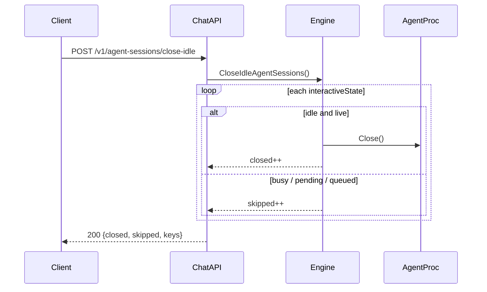

# chat-api Close Idle Agent Sessions Design

> Version: 2026-08-15  
> Status: approved  
> Public API: [chat-api.zh-CN.md](../chat-api.zh-CN.md) / [chat-api.md](../chat-api.md)

## Goal

Expose a chat-api endpoint that **actively closes all idle live agent processes** in the current project `Engine`, without interrupting sessions that are working.

- Preserve cc-connect session metadata and `agent_session_id` so the next message can resume (same as `agent_session_idle_timeout_mins` / `/stop` ID retention).
- Do **not** close busy / permission-waiting / queued sessions.

## Non-goals (v1)

- Per-channel or per-user filtering (scope is the whole Engine, including other IM platforms on the same project).
- Requiring `X-Chat-API-User` / `X-Chat-API-Channel` for this endpoint.
- A parallel Management API endpoint.
- Changing default `agent_session_idle_timeout_mins` behavior.

## Decisions

| Topic | Choice |
|-------|--------|
| Scope | Entire project Engine |
| Auth | Existing chat-api Bearer `api_token` |
| Idle definition | Align with `agent_session_idle_timeout` closable conditions + `Session.Busy()` |
| API path | `POST /v1/agent-sessions/close-idle` |
| Implementation | Engine method + optional binder (Approach A) |

## API

```http
POST /v1/agent-sessions/close-idle
Authorization: Bearer <api_token>
```

| Header | Required | Notes |
|--------|----------|-------|
| `Authorization` | Same as other endpoints when `api_token` is set | Service auth |
| `X-Chat-API-Channel` | **Not required (documented exception)** | Engine-wide op; if present, log for audit |
| `X-Chat-API-User` | Optional | Audit log only |

Request body: empty or `{}`.

Success `200`:

```json
{
  "ok": true,
  "data": {
    "closed": 3,
    "skipped": 1,
    "closed_session_keys": ["chat-api:ch1:conv_a", "feishu:oc_x:ou_y"],
    "skipped_session_keys": ["telegram:1:2"]
  }
}
```

| Field | Meaning |
|-------|---------|
| `closed` | Idle live processes successfully closed |
| `skipped` | Live/interactive states skipped (busy / pending / queued / resync) |
| `*_session_keys` | Corresponding keys for ops verification |

Empty idle set still returns `200` with `closed=0`.

Errors:

| Status | When |
|--------|------|
| `401` | Invalid token (existing behavior) |
| `503` | Closer not bound (Engine not started / not wired) |
| `405` | Non-POST |

## Core architecture

### Interfaces

```go
type IdleAgentSessionCloser interface {
    CloseIdleAgentSessions() CloseIdleAgentSessionsResult
}

type IdleAgentSessionCloserBinder interface {
    BindIdleAgentSessionCloser(c IdleAgentSessionCloser)
}
```

- `Engine` implements `IdleAgentSessionCloser`.
- On `Engine.Start`, bind `e` into platforms that implement `IdleAgentSessionCloserBinder` (same pattern as `SessionManagerBinder`).
- chat-api `Platform` implements the binder and stores the closer.

### Closable (idle) predicate

A state is closable iff all of:

- Present in `interactiveStates`
- `agentSession != nil && Alive()`
- `!stopped`
- `!eventsNeedResync`
- `pending == nil`
- `len(pendingMessages) == 0`
- Matching `Session` is missing or `!Busy()`

Otherwise, if there is a live/interactive state worth reporting, count as `skipped`.

This matches `scheduleAgentSessionIdleClose` / idle-timeout cleanup, plus an explicit Busy check so in-flight turns are never closed.

### Close path

Reuse the same cleanup semantics as `cleanupInteractiveStateForIdleToken`:

1. Cancel idle timer if any
2. Stop unsolicited reader
3. Nil out `agentSession` under lock (double-check predicate)
4. `Close()` the agent process (with existing close timeout)
5. Remove from `interactiveStates`

Do **not** clear `AgentSessionID`.  
Do **not** dispatch `/stop` (ACP `CancelTurn` and related semantics differ).

### Concurrency

- Snapshot candidates under `interactiveMu`
- Re-validate predicate before each close; if now busy → skip
- Synchronous close from the HTTP handler is acceptable (same ceiling as idle timeout close)

## chat-api wiring

- Route: `POST {path}agent-sessions/close-idle`
- Call `closer.CloseIdleAgentSessions()`; unbound → `503`
- `slog.Info` with `closed`, `skipped`, optional user/channel headers

## Flow



## Testing

| Case | Expect |
|------|--------|
| Multiple idle live sessions | All closed; `closed=N` |
| One busy (`Session.Busy` / pending / queue) | That key skipped; others closed |
| No live sessions | `closed=0`, `200` |
| Closer unbound | `503` |
| Message after close on same session | Resumes via preserved `AgentSessionID` |

Core unit tests cover predicate + close; chat-api tests cover HTTP contract.

## Docs to update (implementation)

- `docs/chat-api.zh-CN.md` / `docs/chat-api.md` — new endpoint + Channel header exception
- This design file remains the source of truth for behavior
